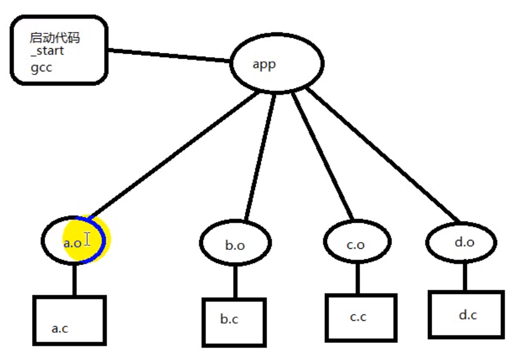
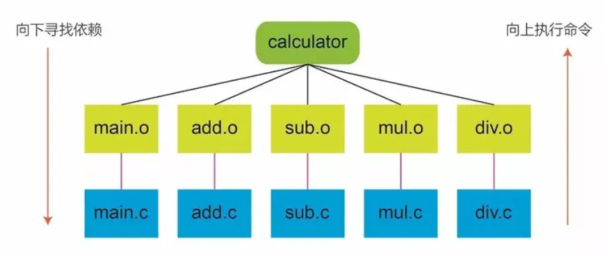
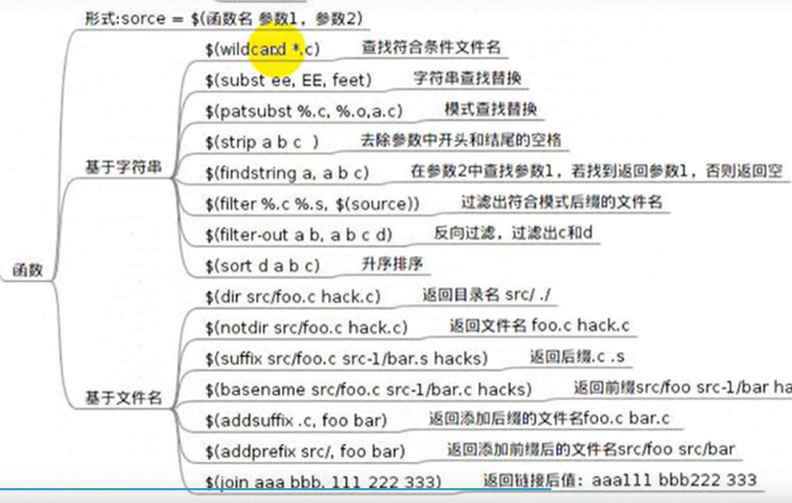

# `makefile`

---

## 1. 用途



- 项目代码编译管理
- 节省编译项目时间
- 一次编写终身受益

---

## 2. 语法

创建`Makefile`文件，该文件项目管理文件，文件内语法为：

```c
# 目标：依赖(条件)
# 命令

例如：
all:add.c sub.c dive.c mul.c main.c
    gcc add.c sub.c dive.c mul.c main.c -o app
```

先建立关系树，即语法分析，自下向上

```c
app:add.o sub.o dive.o main.o
    gcc add.o sub.o dive.o -o app

add.o:add.c
    gcc -c add.c

sub.o:sub.c
    gcc -c sub.c

dive.o:dive.c
    gcc -c dive.c

main.o:main.c
    gcc -c main.c
```

先建立好条件后再进行连接，先编译好`add.o, sub.o, dive.o, main.o`再编译`app`

**执行**:

```c
make 默认执行第一个出现的目标

make dest 执行指定的目标
```

---

## 3. `Makefile`工作原理

- 分析各个目标和依赖之间的关系
- 根据依赖关系自底向上执行命令
- 根据修改时间比目标新，确定更新 -> 最后修改时间
- 如果目标不依赖任何条件，则执行对应命令



---

## 4. `clean`

- 用途：清除编译生成的中间.o文件和最终目标文件
- `make clean`如果当前目录下有同名`clean`文件，则不会执行`clean`对应的命令
- 伪目标声明：`.PHONY:clean`
- `clean`命令中的特殊符号 `-`出错后继续执行后面的命令  `@`不显示命令本身，只显示结果

```c
例如
.PHONY:clean
clean:
      rm -f *.o  // 强制删除
      rm -f app

使用`-`:
      -rm -f *.o
      -rm -f app 

使用`@`:
test:
      @echo "hello"
即：
make clean 就可以删除.o和app文件
```

---

## 5. 使用变量

### 5.1 普通变量

使用变量指向条件

```c
obj=add.o main.o
app:$(obj)
    gcc $(obj) -o app

结果：
yl@yl-virtual-machine:~/test2$ make
cc    -c -o add.o add.c
cc    -c -o main.o main.c
gcc add.o main.o -o app
```

**系统自带变量**：

```c
CC=gcc
cc=gcc
...
```

### 5.2 自动变量

```c
$@  --> 目标
$<  --> 依赖中的第一个条件
$^  --> 所有依赖条件
```

**模式规则**：

在目标及依赖条件中使用`%`来匹配对应的文件

```c
%.o:%.c
    gcc -c $< -o $@

即：
main.o有main.c生成 add.o有add.c生成
```

---

## 6. 函数



### 6.1 `wildcard`

查找符合条件的文件名

```c
src=$(wildcard *.c)   查找.c文件

test:
    echo $(src)
```

### 6.2 `patsubst`

模式查找替换

```c
obj=$(patsubst %c,%.o,$(src))  将src查找到的.c文件都替换为.o

test:
    echo $(obj)
```

---

## 7. 指定常用的编译选项

```c
CPPFLAGS=-Iinclude
CFLAGS=-g -wall
CC=gcc
...
```

---

## 8. `distclean`

彻底清除生成过程文件和生成配置文件

```c
distclean:目标  --> 相当于`rm /usr/bin/app`
```

---

## 9. `install`

安装

```c
install: 目标  --> 相当于`cp app /usr/bin`
```

---

## 10. 嵌套

`make -c 文件`：进入到指定目录中，调用里面的`Makefile`

```c
例如: 子文件为src
make -C src 进入到指定目录中
```

---
