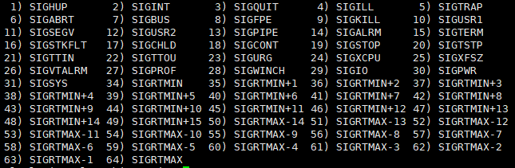
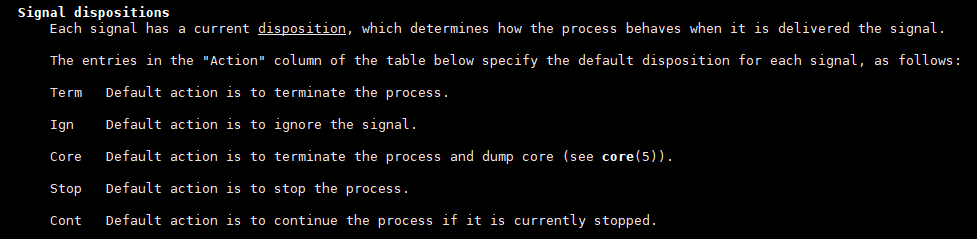

# 概念

- [概念](#概念)
  - [1. 信号编号](#1-信号编号)
  - [2. 信号机制](#2-信号机制)
  - [3. 信号产生种类](#3-信号产生种类)
    - [3.1 终端特殊按键](#31-终端特殊按键)
    - [3.2 硬件异常](#32-硬件异常)
  - [4. 信号产生的原因](#4-信号产生的原因)

---

## 1. 信号编号

`kill -l`



---

## 2. 信号机制

`man 7 signal`



---

## 3. 信号产生种类

### 3.1 终端特殊按键

```c
例如：
ctrl + c  --> SIGINT
ctrl + z  --> SIGTSTP
ctrl + \  --> SIGQUIT
```

### 3.2 硬件异常

- 除0操作
- 访问非法内存
- `kill`函数或`kill`命令，`raise`函数，`abort`函数
- 某种软件条件已发送 例如`alarm`定时器

`kill`函数或`kill`命令

```c
int kill(pid_t pid, int sig)
    pid > 0
        sig发送给ID为pid的进程
    pid == 0
        sig发送给与发送进程同组的所有进程
    pid < 0
        sig发送给组ID为|-pid|的进程，并且发送进程具有向其发送信号的权限
    pid == -1
        sig发送给发送进程有权限向他们发送信号的系统上的所有进程
    sig为0时，用于检测，特定为pid进程是否存在，如不存在，返回-1。
```

---

## 4. 信号产生的原因

```c
1) SIGHUP:当用户退出shell时，由该shell启动的所有进程将收到这个信号，默认动作为终止进程
2）SIGINT：当用户按下了<Ctrl+C>组合键时，用户终端向正在运行中的由该终端启动的程序发出此信号。默认动
作为终止里程。
3）SIGQUIT：当用户按下<ctrl+\>组合键时产生该信号，用户终端向正在运行中的由该终端启动的程序发出些信
号。默认动作为终止进程。
4）SIGILL：CPU检测到某进程执行了非法指令。默认动作为终止进程并产生core文件
5）SIGTRAP：该信号由断点指令或其他 trap指令产生。默认动作为终止里程 并产生core文件。
6) SIGABRT:调用abort函数时产生该信号。默认动作为终止进程并产生core文件。
7）SIGBUS：非法访问内存地址，包括内存对齐出错，默认动作为终止进程并产生core文件。
8）SIGFPE：在发生致命的运算错误时发出。不仅包括浮点运算错误，还包括溢出及除数为0等所有的算法错误。默
认动作为终止进程并产生core文件。
9）SIGKILL：无条件终止进程。本信号不能被忽略，处理和阻塞。默认动作为终止进程。它向系统管理员提供了可
以杀死任何进程的方法。
10）SIGUSE1：用户定义 的信号。即程序员可以在程序中定义并使用该信号。默认动作为终止进程。
11）SIGSEGV：指示进程进行了无效内存访问。默认动作为终止进程并产生core文件。
12）SIGUSR2：这是另外一个用户自定义信号 ，程序员可以在程序中定义 并使用该信号。默认动作为终止进程。1
13）SIGPIPE：Broken pipe向一个没有读端的管道写数据。默认动作为终止进程。
14) SIGALRM:定时器超时，超时的时间 由系统调用alarm设置。默认动作为终止进程。
15）SIGTERM：程序结束信号，与SIGKILL不同的是，该信号可以被阻塞和终止。通常用来要示程序正常退出。执行
shell命令Kill时，缺省产生这个信号。默认动作为终止进程。
16）SIGCHLD：子进程结束时，父进程会收到这个信号。默认动作为忽略这个信号。
17）SIGCONT：停止进程的执行。信号不能被忽略，处理和阻塞。默认动作为终止进程。
18）SIGTTIN：后台进程读终端控制台。默认动作为暂停进程。
19）SIGTSTP：停止进程的运行。按下<ctrl+z>组合键时发出这个信号。默认动作为暂停进程。
21）SIGTTOU:该信号类似于SIGTTIN，在后台进程要向终端输出数据时发生。默认动作为暂停进程。
22）SIGURG：套接字上有紧急数据时，向当前正在运行的进程发出些信号，报告有紧急数据到达。如网络带外数据
到达，默认动作为忽略该信号。
23）SIGXFSZ：进程执行时间超过了分配给该进程的CPU时间 ，系统产生该信号并发送给该进程。默认动作为终止
进程。
24）SIGXFSZ：超过文件的最大长度设置。默认动作为终止进程。
25）SIGVTALRM：虚拟时钟超时时产生该信号。类似于SIGALRM，但是该信号只计算该进程占用CPU的使用时间。默
认动作为终止进程。
26）SGIPROF：类似于SIGVTALRM，它不公包括该进程占用CPU时间还包括执行系统调用时间。默认动作为终止进
程。
27）SIGWINCH：窗口变化大小时发出。默认动作为忽略该信号。
28）SIGIO：此信号向进程指示发出了一个异步IO事件。默认动作为忽略。
29）SIGPWR：关机。默认动作为终止进程。
30）SIGSYS：无效的系统调用。默认动作为终止进程并产生core文件。
31）SIGRTMIN～（64）SIGRTMAX：LINUX的实时信号，它们没有固定的含义（可以由用户自定义）。所有的实时信
号的默认动作都为终止进程。
```

---
