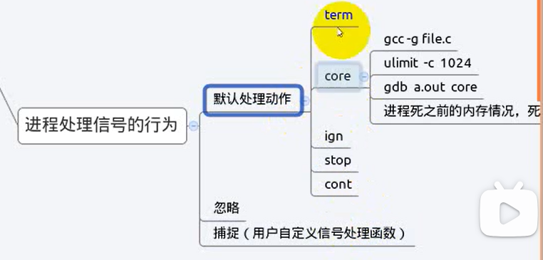
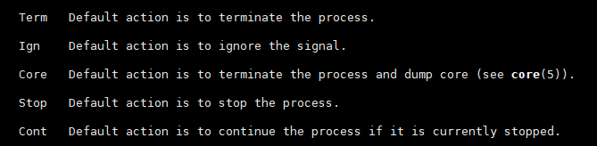
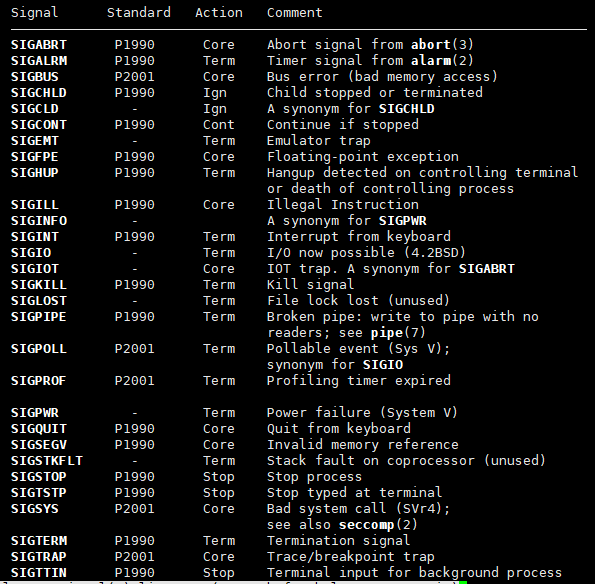

# 进程处理信号的行为



## 1. 默认处理行为

```c
term
core：
    gcc -g file.c
    ulimit -c 1024
    gdb a.out core
    进程死之前的内存情况，死后验尸
ign
stop
cont

Term 表示终止当前进程.
Core 表示终止当前进程并且Core Dump（Core Dump 用于gdb调试）.
Ign  表示忽略该信号.
Stop 表示停止当前进程.
Cont 表示继续执行先前停止的进程.
```



大多数信号对应的动作都为`term`和`core`



## 2. 忽略

## 3. 捕捉(用户自定义信号处理函数)
