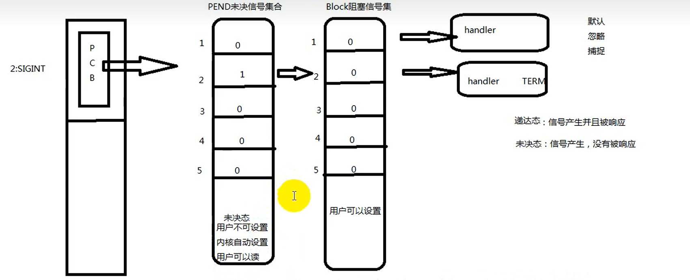
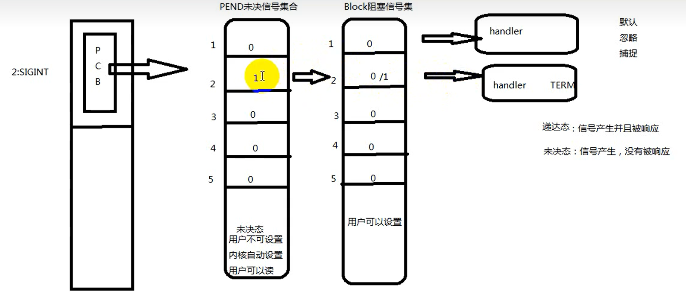

# 信号集和信号屏蔽字

- [信号集和信号屏蔽字](#信号集和信号屏蔽字)
  - [1. 信号集处理函数](#1-信号集处理函数)
  - [2. 信号集和信号屏蔽字](#2-信号集和信号屏蔽字)
    - [2.1 `sigprocmask`](#21-sigprocmask)
    - [2.2 `setpending`](#22-setpending)



## 1. 信号集处理函数

```c
sigset_t为信号集,可sizeof(sigset_t)察看
int sigemptyset(sigset_t *set)                   清空信号集，全部为0
int sigfillset(sigset_t *set)                    全部为1
int sigaddset(sigset_t *set, int signo)          把signo为1
int sigdelset(sigset_t *set, int signo)          把signo为0
int sigismember(const sigset_t *set, int signo)  测试signo信号为什么  
```

## 2. 信号集和信号屏蔽字



**信号屏蔽集**：阻塞信号集

**未决信号集**： 处于未决态，信号产生没有响应

- 第一步：当信号产生时，没有被响应，此时处于未决态，通过`PEND`未决信号集合判断是否处于未决态
- 第二步：判断是否阻塞，通过`Block`阻塞信号集，如果为`1`阻塞，信号不会向上传递
- 第三步：判断没有阻塞后进行信号处理，执行对应的动作

编号在前32位信号不支持排队，产生多少次就计一次，32位之后支持排队，为`实时信号`

### 2.1 `sigprocmask`

读取或更改进程的信号屏蔽字

```c
#include <signal.h>

/* Prototype for the glibc wrapper function */
int sigprocmask(int how, const sigset_t *set, sigset_t *oldset);
```

- `oldset`：如果为非空指针，读取进程的当前信号屏蔽字通过`oldset`参数传出
- `set`： 如果为非空指针，更改进程的信号屏蔽字，参数`how`指示如何更改
- 如果`oldset`和`set`都为非空指针，将原来的信号屏蔽字备份到`oldset`后，然后根据`set`和`how`参数更改信号屏蔽字

`how`:

```c
SIG_BLOCK set包含了我们希望添加到当前信号屏蔽字的信号，相当于mask=mask|set
SIG_UNBLOCK set包含了我们希望从当前信号屏蔽字中解除阻塞的信号，相当于mask=mask&~set
SIG_SETMASK 设置当前信号屏蔽字为set所指向的值，相当于mask=set
```

### 2.2 `setpending`

读取当前进程的未决信号集

```c
#include <signal.h>

int sigpending(sigset_t *set);
```

通过`set`穿出未决信号集，调用成功返回0，否则返回-1

```c
#include <stdio.h>
#include <unistd.h>
#include <signal.h>

void printsigset(sigset_t *set)
{
    for(int i = 0; i< 32; i++){
        if(sigismember(set, i) == 1){
            putchar('1');
        }
        else{
            putchar('0');
        }
    }
    puts("");
}

int main(void)
{
    sigset_t s, p;
    sigemptyset(&s);  // 清空信号集
    sigaddset(&s, SIGINT);  // SIGINT信号为1
    sigprocmask(SIG_BLOCK, &s, NULL);   // 将信号集中的信号 | 当前进程信号集中信号
    while(1){
        sigpending(&p);  // 得到当前未决信号集
        printsigset(&p);
        sleep(1);
    }
    return 0;
}
```

---
