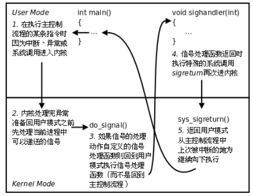
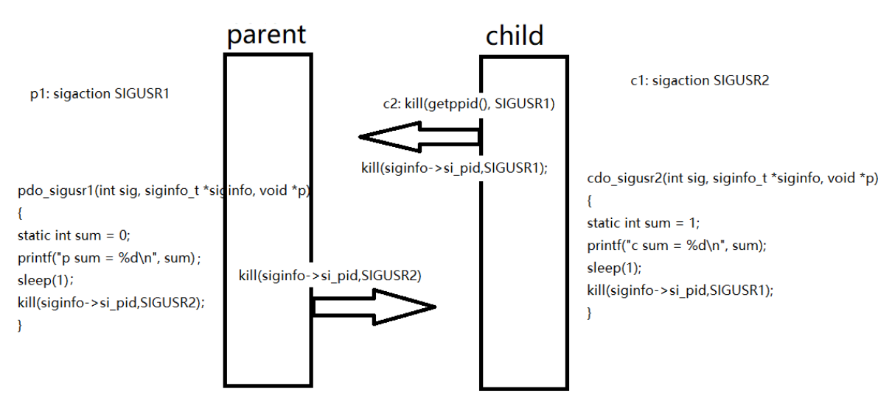

# 信号捕捉设定

- [信号捕捉设定](#信号捕捉设定)
  - [1. `sigaction`](#1-sigaction)
    - [1.1 利用`SIGUSR1`和`SIGUSR2`实现父子进程同步输出](#11-利用sigusr1和sigusr2实现父子进程同步输出)
  - [2. C标准信号处理函数](#2-c标准信号处理函数)
    - [2.1 `signal`函数](#21-signal函数)
    - [2.2 `system`函数](#22-system函数)



## 1. `sigaction`

对指定信号进行捕捉

```c
#include <signal.h>
int sigaction(int signum, const struct sigaction *act,
                struct sigaction *oldact);
signum：为signum信号设置捕捉
act：设置动作
oldset: 原有的动作

struct sigaction 定义:
    struct sigaction {
        void (*sa_handler)(int);
        void (*sa_sigaction)(int, siginfo_t *, void *);
        sigset_t sa_mask;
        int sa_flags;   
        void (*sa_restorer)(void);
    };

sa_handler : 早期的捕捉函数
sa_sigaction : 新添加的捕捉函数，可以传参 , 和sa_handler互斥，两者通过sa_flags选择采用哪种捕捉函数
sa_mask : 在执行捕捉函数时，设置阻塞其它信号，sa_mask | 进程阻塞信号集，退出捕捉函数后，还原回原有的
阻塞信号集
sa_flags : SA_SIGINFO 或者 0
sa_restorer : 保留，已过时
```

`sa_handler`有三个情况：

- `SIG_DFL`：默认捕捉信号
- `SIG_IGN`：忽略信号
- 自定义捕捉函数

例如：

```c
#include <stdio.h>
#include <unistd.h>
#include <signal.h>

void do_sig(int num)
{
    printf("I am do_sig\n");
    printf("num = %d\n", num);
}

int main(void)
{
    struct sigaction act;
    act.sa_handler = do_sig;    // 自定义捕捉函数
    sigemptyset(&act.sa_mask);  // 将信号集清空
    act.sa_flags = 0;           // 使用捕捉函数标志
    sigaction(SIGINT, &act, NULL);
    while(1){
        printf("---\n");
        sleep(1);
    }

    return 0;
}
```

当执行捕捉函数时内核会将当前信号的信号屏蔽设置为1，屏蔽当前信号，直到内核执行完后会将当前信号屏蔽设置为0

### 1.1 利用`SIGUSR1`和`SIGUSR2`实现父子进程同步输出

`SIGUSR1`和`SIGUSR2`可以自定义

子进程继承了父进程的信号屏蔽字和信号处理动作



`siginfo_t`结构体中`si_pid`为发送信号者的pid

```c
siginfo_t {
               int      si_signo;     /* Signal number */
               int      si_errno;     /* An errno value */
               int      si_code;      /* Signal code */
               int      si_trapno;    /* Trap number that caused
                                         hardware-generated signal
                                         (unused on most architectures) */
               pid_t    si_pid;       /* Sending process ID */
               uid_t    si_uid;       /* Real user ID of sending process */
               int      si_status;    /* Exit value or signal */
               clock_t  si_utime;     /* User time consumed */
               clock_t  si_stime;     /* System time consumed */
               union sigval si_value; /* Signal value */
               int      si_int;       /* POSIX.1b signal */
               void    *si_ptr;       /* POSIX.1b signal */
               int      si_overrun;   /* Timer overrun count;
                                         POSIX.1b timers */
               int      si_timerid;   /* Timer ID; POSIX.1b timers */
               void    *si_addr;      /* Memory location which caused fault */
               long     si_band;      /* Band event (was int in
                                         glibc 2.3.2 and earlier) */
               int      si_fd;        /* File descriptor */
               short    si_addr_lsb;  /* Least significant bit of address
                                         (since Linux 2.6.32) */
               void    *si_lower;     /* Lower bound when address violation
                                         occurred (since Linux 3.19) */
               void    *si_upper;     /* Upper bound when address violation
                                         occurred (since Linux 3.19) */
               int      si_pkey;      /* Protection key on PTE that caused
                                         fault (since Linux 4.6) */
               void    *si_call_addr; /* Address of system call instruction
                                         (since Linux 3.5) */
               int      si_syscall;   /* Number of attempted system call
                                         (since Linux 3.5) */
               unsigned int si_arch;  /* Architecture of attempted system call
                                         (since Linux 3.5) */
           }
```

```c
#include <stdio.h>
#include <unistd.h>
#include <signal.h>
#include <sys/stat.h>
#include <sys/types.h>
#include <stdlib.h>

// SIGUSR2 响应函数
void cdo_sig(int sig, siginfo_t *siginfo, void *p)
{
    static int sum = 1;
    printf("child sum = %d\n", sum);
    sum += 2;
    sleep(1);
    kill(siginfo->si_pid, SIGUSR1);  // 向信号发送者发送SIGUSR1
}

// SIGUSR1 响应函数
void pdo_sig(int sig, siginfo_t *siginfo, void *p)
{
    static int sum = 0;
    printf("parent sum = %d\n", sum);
    sum += 2;
    sleep(1);
    kill(siginfo->si_pid, SIGUSR2);  // 向信号发送者发送SIGUSR2
}

int main()
{
    pid_t pid;
    struct sigaction act;
    pid = fork();
    if(pid < 0){
        // fork失败
        perror("fork error");
        exit(1);
    }
    else if(pid == 0){
        // child
        printf("child pid = %d\n", pid);
        act.sa_sigaction = cdo_sig;  // 自定义信号响应函数
        sigemptyset(&act.sa_mask);  
        act.sa_flags = SA_SIGINFO;
        sigaction(SIGUSR2, &act, NULL);  // 当前进程对SIGUSR2信号捕捉，当当前进程接收到SIGUSR2后，执行响应函数
        kill(getppid(), SIGUSR1);  // 保证从父进程开始数
    }
    else{
        // parent
        printf("parent pid = %d\n", getppid());
        act.sa_sigaction = pdo_sig;
        sigemptyset(&act.sa_mask);
        act.sa_flags = SA_SIGINFO;
        sigaction(SIGUSR1, &act, NULL);  // 当前进程对SIGUSR1信号捕捉，当当前进程接收到SIGUSR1后，执行响应函数
    }
    while(1){
        sleep(1);
    }
    return 0;
}
```

---

## 2. C标准信号处理函数

### 2.1 `signal`函数

给对应的信号指定处理函数

```c
#include <signal.h>

typedef void (*sighandler_t)(int);

sighandler_t signal(int signum, sighandler_t handler);
```

**例如**：

```c
#include <stdio.h>
#include <unistd.h>
#include <signal.h>

void handler(int signo)
{
    printf("hello\n");
    sleep(1);
}

int main(void)
{
    signal(SIGINT, handler);  // 给SIGINT信号指定handler处理函数
    while(1){
        printf("----\n");
        sleep(1);
    }
    return 0;
}
```

### 2.2 `system`函数

运行函数

```c
#include <stdlib.h>

int system(const char *command);
集合fork, exec, wait一体
```

**例如**：

```c
system("firefox www.baidu.com");  在firefox中运行www.baidu.com
```

---
