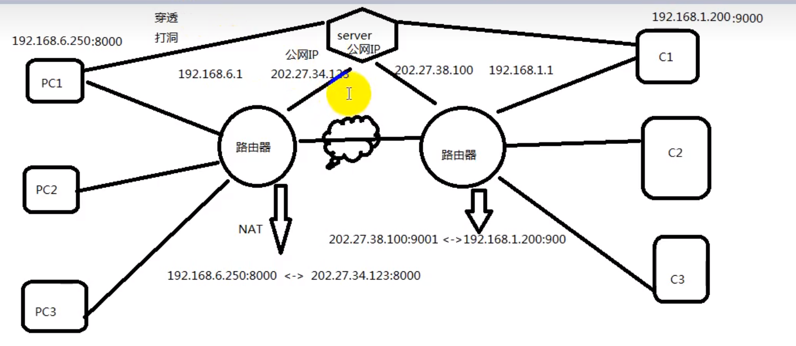

# 穿透打洞

---

## 1. 理解

### 1.1 为什么无法通信

- 在不同局域网内的两台`PC`机是无法通信的，因为不知道对方的`IP`地址

### 1.2  路由器作用

- 实现不同局域网之间的通信是通过路由器进行的，在路由器上通过`net`转换为路由器在公网上的`IP`及其对应的端口号，在公网上找其他局域网的路由器`IP`

### 1.3 服务器作用

- `PC`机通过路由器登录到在公网上的服务器后，服务器记录该`PC`机的路由器公网地址，端口等，如果与其他`PC`机通信，即可以向服务器发送请求得到`PC`对应的路由器公网`IP`和端口，端口对应到`PC`机的端口

---

## 2. 穿透打洞过程

**穿透打洞过程**：

- 先通过路由器建立对应的端口`NAT网关`映射后，登录到服务器上
- 服务器记录接收到的公网IP及对应的端口
- 当`PC`申请向在不同局域网下的其他`PC`机进行通信时，先通过路由器向服务器发送申请后，服务器向对应的公网`IP`上的路由器发送请求，让该`PC`机向对应的地址发送回应
- 建立好连接，两个`PC`就可以通过路由器进行通信
  
---
