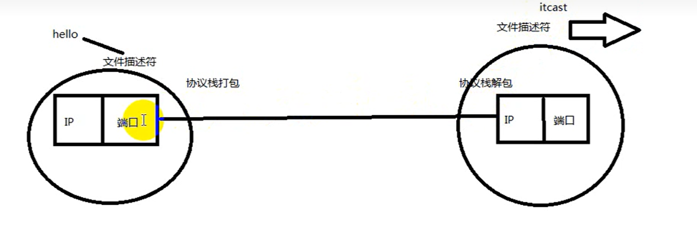

# 预备知识

- [预备知识](#预备知识)
  - [1. 概念](#1-概念)
  - [2. 预备知识](#2-预备知识)
    - [2.1 网络字节序](#21-网络字节序)
    - [2.2 `IP`地址转换函数](#22-ip地址转换函数)
    - [2.3 `sockaddr`数据结构](#23-sockaddr数据结构)


---

## 1. 概念

`IP地址 + TCP或UDP端口号`唯一识别网络通信中的一个进程
`IP地址 +　端口号` -> `socket`



`socket`就是一个特殊的文件

网络中的进程通过`socket`进行通信

在TCP协议中，建立连接的两个进程各自有一个socket来标识，那么这两个socket组成
的socket pair就唯一标识一个连接


---

## 2. 预备知识

### 2.1 网络字节序


小端存储模式：

- 低地址中存放的是字数据的低字节，高地址存放的是字数据的高字节
- `0x12345678`数据中低字节为`78`，内存中低地址为`0x00`，即`78`存储在`0x00`中

大端存储模式：

- 字数据的高字节存储在低地址中，而字数据的低字节则存放在高地址中
- `0x12345678`数据中高字节为`12`，内存中低地址为`0x00`，即`12`存储在`0x00`中

`TCP/IP`协议规定，网络数据流应采用大端字节序，即低地址高字节

当接收端为小端字节序的话，接收时要做字节的转换。发送端为小端字节序发送时也要转换

**网络字节序和主机字节序的转换**：

```c
#include <arpa/inet.h>
uint32_t htonl(uint32_t hostlong);
uint16_t htons(uint16_t hostshort);
uint32_t ntohl(uint32_t netlong);
uint16_t ntohs(uint16_t netshort);
h表示host，n表示network，l表示32位长整数，s表示16位短整数。
如果主机是小端字节序，这些函数将参数做相应的大小端转换然后返回，如果主机是大端字节序，这些函数不做转
换，将参数原封不动地返回。
```

### 2.2 `IP`地址转换函数

```c
#include <arpa/inet.h>
int inet_pton(int af, const char *src, void *dst);
const char *inet_ntop(int af, const void *src, char *dst, socklen_t size);
支持IPv4和IPv6
可重入函数
```

### 2.3 `sockaddr`数据结构


`IPv4`使用`sockaddr_in`结构体表示，包括16位端口号和32位`IP`地址
`IPv6`使用`sockaddr_in6`结构体表示，包括16位端口号，128位`IP`地址和一些控制字段

```c
struct sockaddr_in {
    __kernel_sa_family_t sin_family; /* Address family */
    __be16 sin_port; /* Port number */
    struct in_addr sin_addr; /* Internet address */
    /* Pad to size of `struct sockaddr'. */
    unsigned char __pad[__SOCK_SIZE__ - sizeof(short int) -
    sizeof(unsigned short int) - sizeof(struct in_addr)];
};

/* Internet address. */
struct in_addr {
    __be32 s_addr;
};

struct sockaddr_in6 {
    unsigned short int sin6_family; /* AF_INET6 */
    __be16 sin6_port; /* Transport layer port # */
    __be32 sin6_flowinfo; /* IPv6 flow information */
    struct in6_addr sin6_addr; /* IPv6 address */
    __u32 sin6_scope_id; /* scope id (new in RFC2553) */
};

struct in6_addr {
    union {
        __u8 u6_addr8[16];
        __be16 u6_addr16[8];
        __be32 u6_addr32[4];
    } in6_u;
    #define s6_addr in6_u.u6_addr8
    #define s6_addr16 in6_u.u6_addr16
    #define s6_addr32 in6_u.u6_addr32
};

#define UNIX_PATH_MAX 108
struct sockaddr_un {
    __kernel_sa_family_t sun_family; /* AF_UNIX */
    char sun_path[UNIX_PATH_MAX]; /* pathname */
};
```

各种`socket`地址结构体的开头都是相同的，前16位表示整个结构体的长度（并不是所有UNIX的实现都有长度字段，如Linux就没有），后16位表示地址类型

`IPv4`、`IPv6`和`Unix Domain Socket`的地址类型分别定义为常数`AF_INET`、`AF_INET6`、`AF_UNIX`

`socket API`可以接受各种类型的`sockaddr`结构体指针做参数，例如`bind`、`accept`、`connect`等函数，因为从前16位就可以看出`sockaddr`的类型

---
