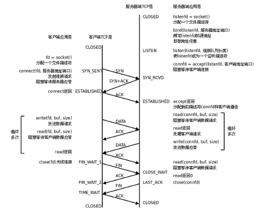

# `C/S`模型-`TCP`



---

## 1. `server`服务器

```c
#include <stdio.h>
#include <ctype.h>
#include <stdlib.h>
#include <string.h>
#include <unistd.h>
#include <sys/socket.h>
#include <netinet/in.h>
#include <arpa/inet.h>
#define MAXLINE 80
#define SERV_PORT 8000
int main(void)
{
    struct sockaddr_in servaddr, cliaddr;
    socklen_t cliaddr_len;
    int listenfd, connfd;
    char buf[MAXLINE];
    char str[INET_ADDRSTRLEN];
    int i, n;
    // 1. socket
    listenfd = socket(AF_INET, SOCK_STREAM, 0);
    bzero(&servaddr, sizeof(servaddr));
    // 地址族协议类型 IPv4
    servaddr.sin_family = AF_INET;
    // IP地址
    servaddr.sin_addr.s_addr = htonl(INADDR_ANY);
    // 端口port
    servaddr.sin_port = htons(SERV_PORT);
    // 2. bind 绑定IP和端口
    bind(listenfd, (struct sockaddr *)&servaddr, sizeof(servaddr));
    // 3. listen 
    listen(listenfd, 20);
    printf("Accepting connections ...\n");
    while (1) {
        cliaddr_len = sizeof(cliaddr);
        // 4. accept阻塞监听客户端链接请求
        connfd = accept(listenfd, (struct sockaddr *)&cliaddr, &cliaddr_len);
        n = read(connfd, buf, MAXLINE);
        // 输出IP 和 端口号
        printf("received from %s at PORT %d\n",
            inet_ntop(AF_INET, &cliaddr.sin_addr, str, sizeof(str)),
            ntohs(cliaddr.sin_port));
        for (i = 0; i < n; i++)
             buf[i] = toupper(buf[i]);
        write(connfd, buf, n);
        close(connfd);
    }
    close(listenfd);

    return 0;
}
```

---

## 2. `client`客户端

```c
#include <netinet/in.h>
#include <stdio.h>
#include <sys/types.h>
#include <sys/socket.h>
#include <string.h>
#include <arpa/inet.h>
#include <unistd.h>
#include <stdlib.h>
#include <sys/stat.h>
#include <fcntl.h>

#define SERVER_PORT 8000
#define MAX_LEN 1024

int main(int argc, char *argv[])
//int main(void)
{
    if(argc < 2){
        printf("./client str\n");
        exit(1);
    }
    struct sockaddr_in serveraddr;
    int confd;
    char ipstr[] = "192.168.208.249";
    char buf[MAX_LEN];
    // 1. 创建一个socket
    confd = socket(AF_INET, SOCK_STREAM, 0);
    // 2. 初始化一个服务器地址
    bzero(&serveraddr, sizeof(serveraddr));
    // 地址族协议 IPv4
    serveraddr.sin_family = AF_INET;
    //serveraddr.sin_addr.s_addr = htonl(INADDR_ANY);
    // 服务器IP地址
    inet_pton(AF_INET, ipstr, &serveraddr.sin_addr.s_addr);
    // 端口号
    serveraddr.sin_port = htons(SERVER_PORT);
    // 3. 链接服务器
    connect(confd, (struct sockaddr *)&serveraddr, sizeof(serveraddr));

    // 4. 请求服务器处理数据
    write(confd, argv[1], strlen(argv[1]));
    int len = read(confd, buf, MAX_LEN);
    write(STDOUT_FILENO, buf, len);
    // 5. 关闭socket
    close(confd);

    return 0;
}
```

---
