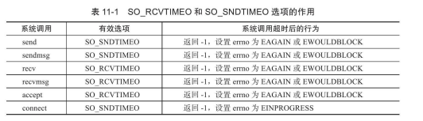

# 定时器

---

## 1. 概念

网络程序需要处理的第三类事件是定时事件，比如定期检测一个客户连接的活动状态。

将每个定时事件封装为成定时器

---

## 2. 定时方法

1. `socket`选项`SO_RCVTIMEO`  和 `SO_SNDTIMEO`
2. `SIGALRM`信号
3. `I/O`复用系统调用的超时参数

---

## 3. 通过`socket`选项设置定时



```c
先创建一个定时器

struct timeval timeout;
timeout.tv_sec = time;
timeout.tv_usec = 0;
socklen_t len = sizeof(timeout);

再通过setsockopt设置定时选项
ret = setsockopt(sockfd, SOL_SOCKET, SO_SNDTIMEO, ＆timeout,len);
```

---

## 4. `SIGALRM`信号设置定时

由`alarm`和`setitimer`函数设置的实时闹钟一旦超时，将触发`SIGALRM`信号

### 4.1 基于升序列表的计时器

```c
```
