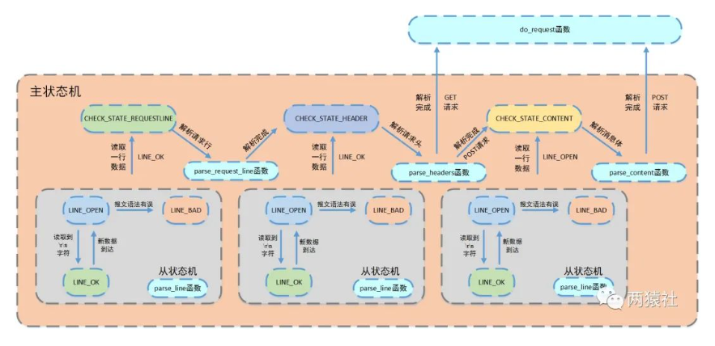

# `http`连接处理2 状态机

---

## 1. 状态机



- 主状态机：
  - `CHECK_STATE_REQUESTLINE`:  解析请求行
  - `CHECK_STATE_HEADER`：解析消息头
  - `CHECK_STATE_CONTENT`：解析消息体，仅解析`POST`请求

- 从状态机：
  - `LINE_OK`：成功读取一行
  - `LINE_BAD`：语法出错
  - `LINE_OPEN`：读取的行不完整

```c++
void http_conn::process()
{
  // 读取请求信息
    HTTP_CODE read_ret = process_read();

    //NO_REQUEST，表示请求不完整，需要继续接收请求数据
    if(read_ret == NO_REQUEST)
    {
        //注册并监听读事件
        modfd(m_epollfd,m_sockfd,EPOLLIN);
        return;
    }

    //调用process_write完成报文响应
    bool write_ret = process_write(read_ret);
    if(!write_ret)
    {
       close_conn();
    }
    //注册并监听写事件
    modfd(m_epollfd,m_sockfd,EPOLLOUT);
}
```

`process`：

- `process_read`读取请求报文的内容，解析报文内容
- `process_write`根据请求报文的请求内容进行报文响应

---

## 2. 解析报文过程

`process_read`：

```c++
http_conn::HTTP_CODE http_conn::process_read()
{
    LINE_STATUS line_status = LINE_OK;
    HTTP_CODE ret = NO_REQUEST;
    char *text = 0;

    while ((m_check_state == CHECK_STATE_CONTENT && line_status == LINE_OK) || ((line_status = parse_line()) == LINE_OK))
    {
        text = get_line();
        m_start_line = m_checked_idx;
        LOG_INFO("%s", text);
        switch (m_check_state)
        {
          case CHECK_STATE_REQUESTLINE:
          {
              ret = parse_request_line(text);
              if (ret == BAD_REQUEST)
                  return BAD_REQUEST;
              break;
          }
          case CHECK_STATE_HEADER:
          {
              ret = parse_headers(text);
              if (ret == BAD_REQUEST)
                  return BAD_REQUEST;
              else if (ret == GET_REQUEST)
              {
                  return do_request();
              }
              break;
          }
          case CHECK_STATE_CONTENT:
          {
              ret = parse_content(text);
              if (ret == GET_REQUEST)
                  return do_request();
              line_status = LINE_OPEN;
              break;
          }
          default:
              return INTERNAL_ERROR;
        }
    }
    return NO_REQUEST;
}
```

**过程**：

循环体：

- 从状态机读取数据
- 调用`get_line`函数，通过`m_start_line`将从状态机读取到的数据间接赋值给`text`
- 主状态机调用`text`

主状态机判断：

- 主状态机转移到`CHECK_STATE_CONTENT`，解析消息体
- 从状态机转移到`LINE_OK`，解析请求行和请求头部

---

## 4. 从状态机逻辑

从状态机读取`buffer`中的数据，得出每行的数据

在`HTTP`报文中，每行的数据都是按`\r\n`作为结束字符，空行仅为`\r\n`

流程：

- 从状态机从`m_read_buf`中逐字节读取，判断当前字节是否为`\r`
  - 如果下一个字符为`\n`，即将`\r\n`修改为`\0\0`，将`m_checked_idx`指向下一行的开头，返回`LINE_OK`
  - 如果到达`buffer`结尾，继续接收，返回`LINE_OPEN`
  - 否则为语法错误，返回`LINE_BAD`
- 如果当前字节不是`\n`，判断前一个字节是否为`\r`：为重新接收的内容
  - 如果前一个字符为`\r`，将`\r\n`修改为`\0\0`，将`m_checked_idx`指向下一行的开头
- 当前字节既不是`\r`也不是`\n`
  - 表示接收不完整，需要继续接收，返回`LINE_OPEN`

```c++
http_conn::LINE_STATUS http_conn::parse_line()
{
    char temp;
    for (; m_checked_idx < m_read_idx; ++m_checked_idx)
    {
        temp = m_read_buf[m_checked_idx];
        if (temp == '\r')
        {
            if ((m_checked_idx + 1) == m_read_idx)
                return LINE_OPEN;
            else if (m_read_buf[m_checked_idx + 1] == '\n')
            {
                m_read_buf[m_checked_idx++] = '\0';
                m_read_buf[m_checked_idx++] = '\0';
                return LINE_OK;
            }
            return LINE_BAD;
        }
        else if (temp == '\n')
        {
            if (m_checked_idx > 1 && m_read_buf[m_checked_idx - 1] == '\r')
            {
                m_read_buf[m_checked_idx - 1] = '\0';
                m_read_buf[m_checked_idx++] = '\0';
                return LINE_OK;
            }
            return LINE_BAD;
        }
    }
    return LINE_OPEN;
}
```

---

## 5. 主状态机逻辑

调用从状态机来驱动主状态机，在主状态机进行解析前，从状态机将每一行的末尾`\r\n`改为`\0\0`，以便主状态机取出对应字符串进行处理

### 5.1 `CHECK_STATE_REQUESTLINE`

- `CHECK_STATE_REQUESTLINE`：
  - 主状态机的初始状态，调用`parse_request_line`解析请求行
  - 解析函数从`m_read_buf`中解析`HTTP`请求行，获取请求方法，目标`URL`，`HTTP`版本号
  - 解析完后主状态机的状态为`CHECK_STATE_HEADER`

```c++
//解析http请求行，获得请求方法，目标url及http版本号
http_conn::HTTP_CODE http_conn::parse_request_line(char *text)
{
    m_url = strpbrk(text, " \t");
    if (!m_url)
    {
        return BAD_REQUEST;
    }
    *m_url++ = '\0';
    char *method = text;
    if (strcasecmp(method, "GET") == 0)
        m_method = GET;
    else if (strcasecmp(method, "POST") == 0)
    {
        m_method = POST;
        cgi = 1;
    }
    else
        return BAD_REQUEST;
    m_url += strspn(m_url, " \t");
    m_version = strpbrk(m_url, " \t");
    if (!m_version)
        return BAD_REQUEST;
    *m_version++ = '\0';
    m_version += strspn(m_version, " \t");
    if (strcasecmp(m_version, "HTTP/1.1") != 0)
        return BAD_REQUEST;
    if (strncasecmp(m_url, "http://", 7) == 0)
    {
        m_url += 7;
        m_url = strchr(m_url, '/');
    }

    if (strncasecmp(m_url, "https://", 8) == 0)
    {
        m_url += 8;
        m_url = strchr(m_url, '/');
    }

    if (!m_url || m_url[0] != '/')
        return BAD_REQUEST;
    //当url为/时，显示判断界面
    if (strlen(m_url) == 1)
        strcat(m_url, "judge.html");
    m_check_state = CHECK_STATE_HEADER;
    return NO_REQUEST;
}
```

### 5.2 `CHECK_STATE_HEADERS`

请求行解析完后，主状态机解析分析请求头，如果当前的`text`首位是不是`\0`字符，如果是当前处理的是空行，若不是，则处理的是请求行

- `CHECK_STATE_HEADERS`：
  - 调用`parse_headers`解析请求头部信息
  - 判断是空行还是请求头
    - 如果是空行，判断`content-length`是否为0，如果不是0，表明是`POST`请求，则将状态切换为`CHECK_STATE_CONTENT`，否则是`GET`请求，则报文解析结束
  - 若干解析的是请求头部字端
    - `Connection`连接字段
      - 判断是否为`keep-alive`
    - `Content-length`请求内容字段长度
    - 请求头部`HOST`字段

```c++
//解析http请求的一个头部信息
http_conn::HTTP_CODE http_conn::parse_headers(char *text)
{
    if (text[0] == '\0')
    {
        if (m_content_length != 0)
        {
            m_check_state = CHECK_STATE_CONTENT;
            return NO_REQUEST;
        }
        return GET_REQUEST;
    }
    else if (strncasecmp(text, "Connection:", 11) == 0)
    {
        text += 11;
        text += strspn(text, " \t");
        if (strcasecmp(text, "keep-alive") == 0)
        {
            m_linger = true;
        }
    }
    else if (strncasecmp(text, "Content-length:", 15) == 0)
    {
        text += 15;
        text += strspn(text, " \t");
        m_content_length = atol(text);
    }
    else if (strncasecmp(text, "Host:", 5) == 0)
    {
        text += 5;
        text += strspn(text, " \t");
        m_host = text;
    }
    else
    {
        LOG_INFO("oop! unknow header: %s", text);
    }
    return NO_REQUEST;
}
```

### 5.3 `CHECK_STATE_CONTENT`

- `CHECK_STATE_CONTENT`
  - 仅用于解析`POST`请求，调用`parse_content`函数解析消息体
  - 用于保存`past`请求消息体，为后面的登录和注册做准备

```c++
//判断http请求是否被完整读入
http_conn::HTTP_CODE http_conn::parse_content(char *text)
{
    if (m_read_idx >= (m_content_length + m_checked_idx))
    {
        text[m_content_length] = '\0';
        //POST请求中最后为输入的用户名和密码
        m_string = text;
        return GET_REQUEST;
    }
    return NO_REQUEST;
}
```

---
