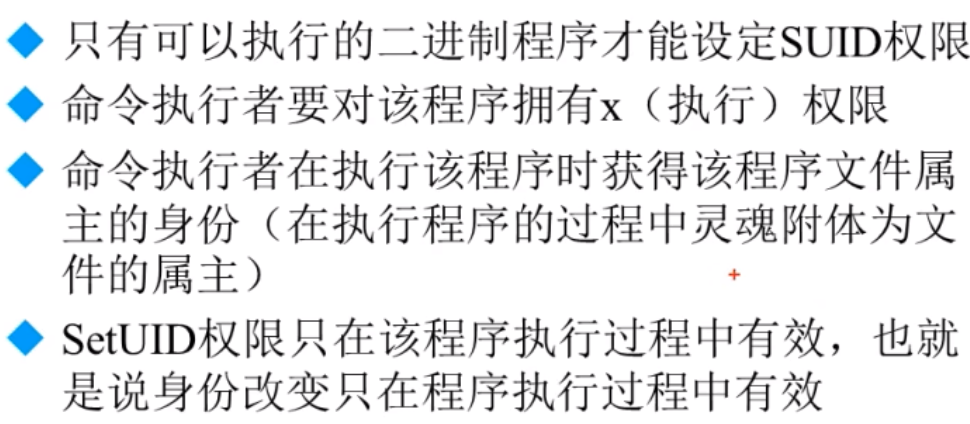
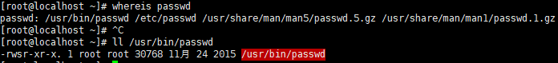
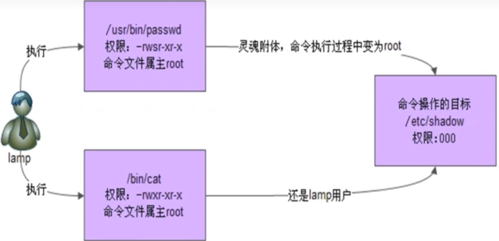
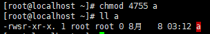
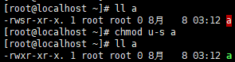

# 文件特殊权限-`SetUID`

- [文件特殊权限-`SetUID`](#文件特殊权限-setuid)
  - [1. `SetUID`的功能](#1-setuid的功能)
  - [2. 设置`SetUID`的方法](#2-设置setuid的方法)
  - [3. 取消`SetUID`的方法](#3-取消setuid的方法)
  - [4. 危险的 `SUID`设置](#4-危险的-suid设置)

---

## 1. `SetUID`的功能



`passwd`命令拥有`SUID`权限



**图示**：



---

## 2. 设置`SetUID`的方法

```Linux
4代表SUID  --> 二进制
chmod 4755 文件名
chmod u+s  文件名
```



---

## 3. 取消`SetUID`的方法

```Linux
在当前权限下取消SUID即可
chmod 755 文件名
chmod u-s 文件名
```



---

## 4. 危险的 `SUID`设置

当给一些重要的文件`SUID`权限时，普通用户就可以对重要文件进行修改 **很危险**


