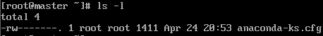

# 命令格式和目录处理命令  

## 命令格式

```linux
命令格式：命令 [-选项] [参数] 
    例如： ls -la /etc  显示/etc中的文件
-a --> -all 
-l --> -long  
-lh 人性化显示 比如显示内存大小:1205-->1.2k 
```  

## 目录处理命令

```Linux
功能:
ls ---> 即list 显示目录文件

语法:
ls [-ald] [文件/目录]    可以搭配 ls -a/-l/-d/-al/-ad/ald/-ld [文件/目录]
ls -a [] 显示所有的文件，包含隐藏文件
ls -l [] 详细信息显示
ls -d [] 查看目录属性信息 显示当前目录本身，不显示文件下的内容 一般和-l一起使用
ls -i [] 显示文件和目录的索引号
```  

`la []`：显示所有文件，不包含隐藏文件


`ls -a []`：显示所有的文件，包含隐藏文件


`ls -l []`：显示详细的信息
一条信息中表示为: 文件类型 + 文件权限 + 文件计数 + 文件所有者 + 文件所属组 + 文件大小 + 文件最后修改时间 + 文件名

 

`ls -d []`：显示目录本身的信息


`ls -i []`：显示文件和目录的索引号  


## 文件类型以及文件权限

```Linux
文件类型:
- 二进制类型
d 目录
l 软链接文件

文件权限:
-rw-r--r--:  
第一个字符表示文件类型 -,d,l
后面的字符表示组的权限: 每三个一组  每组为rwx, 如果某位为-，即该组没有这个权限
     -  rw-   r--   r--
         u     g     o
    u: 所有者 
    g: 所属组
    o: 其他人
    
     r: 读   w: 写  x: 执行  -代表没有这个权限
```  
