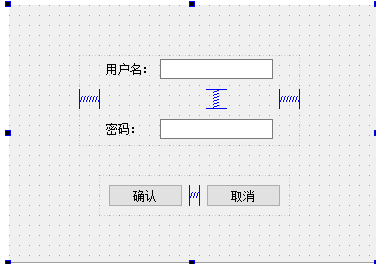
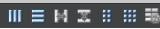

# 页面布局

- [页面布局](#页面布局)
  - [1. 实现登录窗口](#1-实现登录窗口)
  - [2. 使用`widget`进行布局](#2-使用widget进行布局)
  - [3. 其他布局](#3-其他布局)

---

## 1. 实现登录窗口

---

## 2. 使用`widget`进行布局

将控件放入到`widget`中可以进行水平，垂直，栅格对齐

## 3. 其他布局

1. 默认窗口和控件之间有9个像素，可以调整，在`layout`里面
2. 利用弹簧进行布局
3. 默认窗口的大小可以固定，将最大伸展和最小伸展设置为固定值

---
