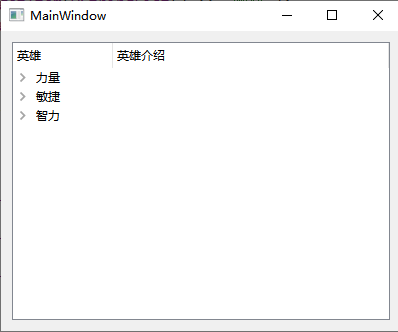

# 控件

- [控件](#控件)
  - [1. `Button`](#1-button)
  - [2. `Item Widget`](#2-item-widget)
    - [2.1 `List Widget`](#21-list-widget)
    - [2.2 `Tree Widget`](#22-tree-widget)
    - [2.3 `Table Widget`](#23-table-widget)
  - [3. 其他控件](#3-其他控件)
    - [3.1 `Stack Widget`控件](#31-stack-widget控件)
    - [3.2 `Combo Box`控件](#32-combo-box控件)
    - [3.3 `QLabel`控件](#33-qlabel控件)

---

## 1. `Button`

- `QPushButton`
- `QToolButton` 工具按钮，用于显示图片
  - `toolButtonStyle` 修改风格
  - `autoRaise` 凸起风格
- `radioButton` 单选按钮， 设置默认`ui->btn->setChecked(true)`
- `checked` 多选按钮，监听按钮，2选中，1半选，0未选中

---

## 2. `Item Widget`


### 2.1 `List Widget`

```c++
// 单行添加
QListWidgetItem *item = new QListWidgetItem("aaaa");
ui->listWidget->addItem(item);
// 调整格式，居中
item->setTextAlignment(Qt::AlignHCenter); 

// 多行添加 不能调整格式
QStringList list;
list << "aaa" << "bbb" << "ccc";
ui->listWidget->addItems(list);
```

### 2.2 `Tree Widget`



```c++
// 设置水平头
ui->treeWidget->setHeaderLabels(QStringList()<< "英雄" << "英雄介绍");

// 设置顶层结点
QTreeWidgetItem *item1 = new  QTreeWidgetItem(QStringList() << "力量");
QTreeWidgetItem *item2 = new  QTreeWidgetItem(QStringList() << "敏捷");
QTreeWidgetItem *item3 = new  QTreeWidgetItem(QStringList() << "智力");

// 加载顶层结点
ui->treeWidget->addTopLevelItem(item1);
ui->treeWidget->addTopLevelItem(item2);
ui->treeWidget->addTopLevelItem(item3);

// 追加子节点
QStringList hero;
hero << "刚备注" << "aaaaaaaaaaaa";
QTreeWidgetItem *l1 = new QTreeWidgetItem(hero);
item1->addChild(l1);
QTreeWidgetItem *l2 = new QTreeWidgetItem(QStringList() << "tt" << "atatata");
item2->addChild(l2);
QTreeWidgetItem *l3 = new QTreeWidgetItem(QStringList() << "cc" << "aaaaac");
item3->addChild(l3);
```

### 2.3 `Table Widget`


```c++
// 设置列数
ui->tableWidget->setColumnCount(3);

// 设置水平表头
ui->tableWidget->setHorizontalHeaderLabels(QStringList() << "姓名" << "性别" << "年龄");

// 设置行数
ui->tableWidget->setRowCount(5);

// 设置正文
QStringList namelist, sexlist, agelist;
namelist << "大哥" << "二哥" << "三哥" << "四哥" << "五哥";
sexlist << "男" << "男" << "男" << "男" << "男" << "男";
agelist << "26" << "24" << "23" << "21" << "19";

for(int i = 0; i < 5; i++){
int col = 0;
    ui->tableWidget->setItem(i, col++, new QTableWidgetItem(namelist[i]));
    ui->tableWidget->setItem(i, col++, new QTableWidgetItem(sexlist[i]));
    ui->tableWidget->setItem(i, col++, new QTableWidgetItem(agelist[i]));
}
```

---

## 3. 其他控件

- `Scroll Area`可以下拉内容
- `Tool Box`类似于文件夹
- `Tab Widget`类似于网页

### 3.1 `Stack Widget`控件

可以翻不同页面，可以绑定按钮，点击不同按钮，对应不同编号的页面

```c++
// 栈控件使用
ui->stackedWidget->setCurrentIndex(0);  // 默认界面

connect(ui->btn_scroll_area, &QPushButton::clicked, [=](){
    ui->stackedWidget->setCurrentIndex(0);
});

connect(ui->btn_toolbox, &QPushButton::clicked, [=](){
    ui->stackedWidget->setCurrentIndex(1);
});

connect(ui->btn_tab_widget, &QPushButton::clicked, [=](){
    ui->stackedWidget->setCurrentIndex(2);
});
```

### 3.2 `Combo Box`控件


```c++
ui->comboBox->addItem("a");
ui->comboBox->addItem("b");
ui->comboBox->addItem("c");

// 点击按钮选中
connect(ui->btn_checked, &QPushButton::clicked, [=](){
        ui->comboBox->setCurrentIndex(1);
        // ui->comboBox->setCurrentText("c");  // 前提是要有该文本的选项
});
```

### 3.3 `QLabel`控件

可以显示文字，也可以显示图片，视频


```c++
// 显示图片
 ui->label_image->setPixmap(QPixmap(":/Camera Roll/backiee-101151.jpg"));

// 显示视频
QMovie *movie = new QMovie(":/Camera Roll/006APoFYly8gz1yv2qqn6g307307348n.gif");
ui->label_movie->setMovie(movie);
movie->start();
```

---
