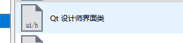
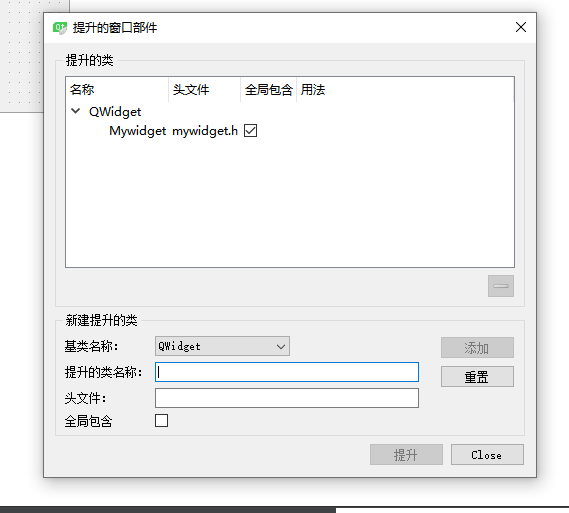
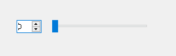

# 自定义控件

- [自定义控件](#自定义控件)
  - [1. 创建`QT`设计师界面类](#1-创建qt设计师界面类)
  - [2. 在`Widget`中提升](#2-在widget中提升)
  - [3. 对`spinbox` 和 `horizontalSlider`关联](#3-对spinbox-和-horizontalslider关联)

---

## 1. 创建`QT`设计师界面类



可以设计界面，供其他界面使用

---

## 2. 在`Widget`中提升



提升过后，即可用于界面

---

## 3. 对`spinbox` 和 `horizontalSlider`关联



```c++
// spinbox数字变， SliderBox长度边
// 有重载，指向有参数的那个函数
void(QSpinBox:: *ValChanged)(int) = &QSpinBox::valueChanged;
// spinBox值变, SliderBox长度跟着变
connect(ui->spinBox, ValChanged, ui->SliderBox, &QSlider::setValue);

// SliderBox长度变, spinBox值跟着变
connect(ui->SliderBox, &QSlider::valueChanged, ui->spinBox, &QSpinBox::setValue);
```

---
