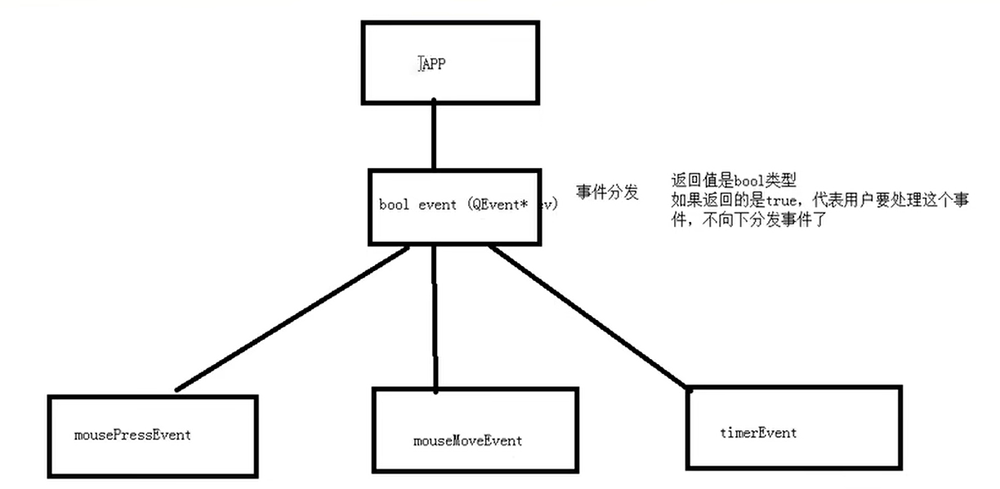

# 事件分发



`bool event(QEvent *e)` 负责进行事件的分发，如果返回`true`代表用户处理了该事件，不向下分发事件

例如： 可以重新实现`event`，对某一些事件进行处理，其他事件交给父类的`event`默认处理

```c++
bool MyLabel::event(QEvent *e)
{
    if(e->type() == QEvent::MouseButtonPress){
        QMouseEvent *ev = static_cast<QMouseEvent *>(e);
        QString str = QString("event::鼠标按下 x = %1 y = %2").arg(ev->x()).arg(ev->y());
        qDebug() << str;

        return true;   // 表示用户已经处理，不用向下分发
    }
    return QLabel::event(e);    // 其他交给父类处理  默认处理
}

```
