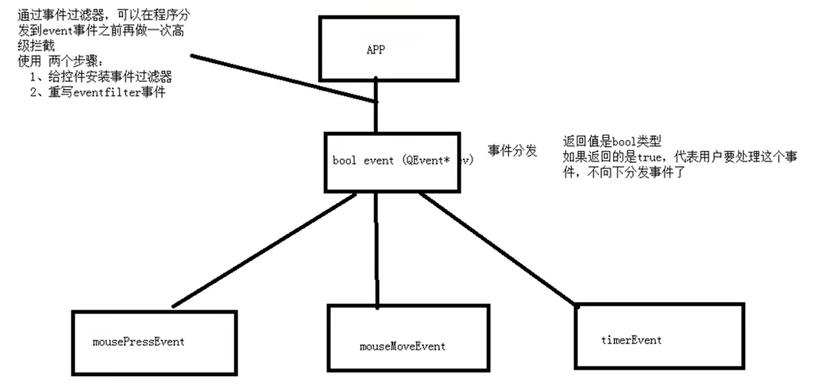

# 事件过滤器



## 使用控件过滤器

- 安装控件过滤器
- 重写`eventFilter`事件

```c++
// 安装事件过滤器
ui->label->installEventFilter(this);

//重写eventFilter事件
bool MainWindow::eventFilter(QObject *watched, QEvent *event)
{
    if(ui->label == watched){
        if(event->type() == QEvent::MouseButtonPress){
            QMouseEvent *ev = static_cast<QMouseEvent *>(event);
            QString str = QString("eventfilter::鼠标按下 x = %1 y = %2").arg(ev->x()).arg(ev->y());
            qDebug() << str;

            return true;
        }
    }
    return QObject::eventFilter(watched, event);
}
```
