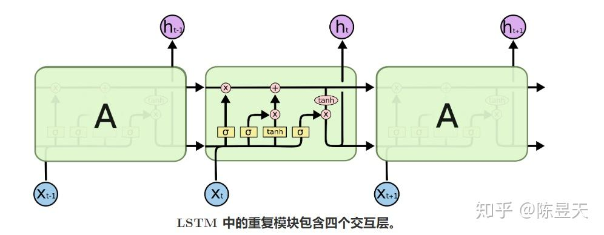
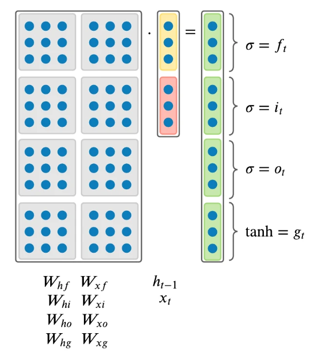

# LSTM

---

## 直观理解（为什么要用 LSTM）

Vanilla RNN 在长序列上会遇到**梯度消失/爆炸**和“短记忆”问题。  
**LSTM** 引入了“细胞状态（cell state）`c_t`”与若干**门（gates）**，通过门控机制选择性地**记住/遗忘/输出**信息，从而能学到更长距离的依赖。

把 LSTM 想象成带阀门的流水管：阀门决定哪些信息进入管道（记住）、哪些信息流走（忘记）、哪些信息可以被取出（输出）。

---

## 数学公式（单步更新，标准 LSTM）

假设输入为 \(x_t\)，上一时刻隐藏态 \(h_{t-1}\)，上一时刻细胞态 \(c_{t-1}\)。  
每步计算：

\[
\begin{aligned}
i_t &= \sigma(W_{xi} x_t + W_{hi} h_{t-1} + b_i) \quad\text{（输入门）}\\
f_t &= \sigma(W_{xf} x_t + W_{hf} h_{t-1} + b_f) \quad\text{（遗忘门）}\\
o_t &= \sigma(W_{xo} x_t + W_{ho} h_{t-1} + b_o) \quad\text{（输出门）}\\
g_t &= \tanh(W_{xg} x_t + W_{hg} h_{t-1} + b_g) \quad\text{（候选细胞态）}\\
c_t &= f_t \odot c_{t-1} + i_t \odot g_t \\
h_t &= o_t \odot \tanh(c_t)
\end{aligned}
\]

- 遗忘门\(f_{t}\)： 控制有多少来自\(c_{t-1}\)的信息该被移除。遗忘门用于学习删除来自早先时间节点的隐藏信息，这也是为什么LSTM有两个隐藏信息\(h_t\)和\(c_{t}\)，因为\(c_{t}\)将会被一直传播下去，并且学习是否忘记部分来自先前细胞的状态。
- 输入门\(i_{t}\)： 控制有多少来自\(h_{t-1}\)和\(x_{t}\)的信息应该被添加到\(c_{t}\)中。输入门使用的是sigmoid函数，可以将输入的值缩放到0到1之间。如果其值要么几乎总是0，或者要么总是1时，输入门就可以看成一个开关。它决定了是否将RNN的输出结果\(g_{t}\)添加到\(c_{t}\)中。
- 输出门\(o_{t}\)： 控制有多少来自\(h_{t}\)的信息需要被作为输出值展示。
- \(\sigma\) 是 sigmoid，\(\odot\) 表示逐元素乘积。  
- 参数通常按输入/隐藏拼接来实现：例如把 \(W_{xi},W_{xf},W_{xg},W_{xo}\) 合并为一个矩阵一次计算，然后切分。



**拼接写法（高效实现常用）**：
\[
z = x_t W_x + h_{t-1} W_h + b \quad\Rightarrow\quad z = [z_i, z_f, z_g, z_o]
\]
然后用 `sigmoid`/`tanh` 分别处理切片。



---

## 门的取值（极端情况）

**$f_t \approx 1,\; i_t \approx 0$**  
  几乎只保留旧记忆，不写入新内容 → **长期记忆保持**。  
  细胞态更新项为 $c_t \approx 1 \odot c_{t-1} + 0 \odot g_t \approx c_{t-1}$，表示网络选择保留历史信息而不引入新的记忆。

**$f_t \approx 0,\; i_t \approx 1$**  
  丢弃旧记忆，完全用新候选替代 → **相当于重置记忆**。  
  此时 $c_t \approx 0 \odot c_{t-1} + 1 \odot g_t \approx g_t$，原先的记忆被清空，新的候选信息成为当前细胞态。

**$o_t \approx 0$**  
  保留内部状态但不输出（对外不可见）。  
  虽然 $c_t$ 可能保存大量信息，但 $h_t = o_t \odot \tanh(c_t) \approx 0$，外部模块或下游时间步看不到这些内部状态，等于是把内部记忆“屏蔽”起来。


---

## 单步实现思路

```python
# shapes:
# x: (N, D)
# prev_h: (N, H)
# prev_c: (N, H)
# Wx: (D, 4H), Wh: (H, 4H), b: (4H,)

z = x.dot(Wx) + prev_h.dot(Wh) + b   # (N, 4H)
zi, zf, zg, zo = np.split(z, 4, axis=1)

i = sigmoid(zi)
f = sigmoid(zf)
g = np.tanh(zg)
o = sigmoid(zo)

next_c = f * prev_c + i * g
next_h = o * np.tanh(next_c)
```
