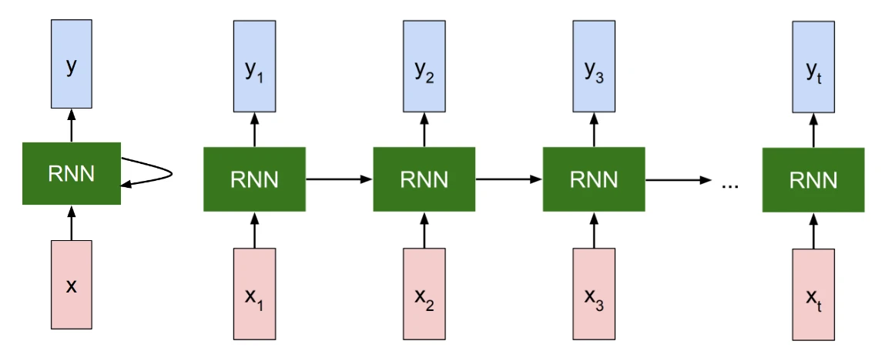

# RNN

## RNN 的基本概念

RNN 用来处理序列数据（文本、语音、时间序列、视频帧序列等）

普通的全连接网络（MLP）在处理输入时，是一股脑把输入一次性送进网络的，没有“记忆”。
而 RNN（Recurrent Neural Network） 的特点是：

- 处理序列数据时，不是一次性处理，而是 按时间步（time step）依次处理；
- 每一步不仅依赖当前输入，还依赖 上一步的隐藏状态（hidden state），这样就有了“记忆”的效果。

公式（Vanilla RNN 版本）：

\[
h_t = \tanh(x_t W_x + h_{t-1} W_h + b)
\]

- \( h_t \)：当前时间步的隐藏状态
- \( x_t \)：当前输入（如当前单词的词向量）
- \( W_x, W_h, b \)：RNN 参数
- \(\tanh\)：非线性激活函数



## 在 CaptioningRNN 中的角色

图像字幕生成任务中：

1. **CNN 提取图像特征**  
   - 得到固定维度的向量 `features`

2. **映射到 RNN 初始隐藏状态 \( h_0 \)**  

```python
h0, _ = affine_forward(features, W_proj, b_proj)
```

3. **将单词索引转换为词向量**

```python
captions_in_emb, _ = word_embedding_forward(captions_in, W_embed)
```

4. **RNN 正向传播**

```python
h, _ = rnn_forward(captions_in_emb, h0, Wx, Wh, b)
```

5. **隐藏状态 → 词汇表 logits**

```python
scores, _ = temporal_affine_forward(h, W_vocab, b_vocab)
```

6. **Softmax 计算损失**

```python
loss, dout = temporal_softmax_loss(scores, captions_out, mask)
```

## 推理阶段（Sample）

推理时不需要计算梯度，而是逐步生成：

1. 输入 <START> token
2. 得到预测分布，从中选出概率最高的单词
3. 用这个单词作为下一步的输入
4. 循环直到 <END> 或到达最大长度

## 流程图

```python
   [Image]
      ↓ CNN
[Image Features]
      ↓ Affine (W_proj, b_proj)
   [h0 初始隐藏状态]
      ↓
  ┌───────────────────────────────┐
  │   RNN / LSTM 循环展开 (T 步)  │
  │                               │
  │   x_t (词向量)  +  h_{t-1}    │
  │          ↓                    │
  │      RNN 单元                 │
  │          ↓                    │
  │     h_t (隐藏状态)            │
  └───────────────────────────────┘
      ↓
[全连接层 → Softmax]
      ↓
 [预测下一个单词]
```