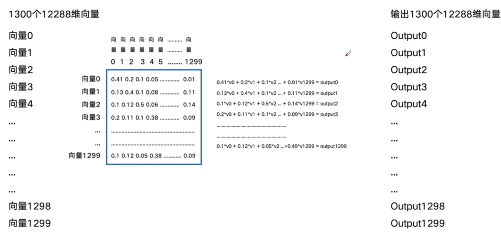

# Transformer

---

## 概念

Transformer 的关键思想是：用自注意力（self-attention）让序列中每个位置直接“查看”序列上所有位置的信息，替代循环结构。因此能并行计算、有效建模长距离依赖。

---

## 架构

.png).png)

### inputs

文本经过 Tokenizer 后的 token 序列

`token`: 机器无法直接读取词汇、语句、图像、声音等等，而是通过Token来进行的。Tokenizer将组合词、句子、段落、文章这类型的长文本分解为最小单位的Token词元，然后再通过Embedding的方式把token转化为向量表示的数据结构

```python
原始文本: I love NLP
Tokenizer分词: ["[CLS]", "I", "love", "NL", "##P", "[SEP]"]
转成 Token IDs： [101, 1045, 2293, 8723, 2361, 102]
```

### token Embedding

每个`token ID`通过查表（`lookup table`）映射到一个固定维度的向量，比如 512 维或 768 维。

```python
[ [0.12, -0.45, ..., 0.33],    # [CLS]
  [0.87,  0.22, ..., -0.19],   # I
  [-0.11, 0.56, ..., 0.44],    # love
  ... ]
```

### Positional Encoding

给每个token向量加上它的位置信息, Transformer中使用公式计算位置

`pos`为单词在句子中的位置，`d`表示维度


### input Embedding

```python
Input Embedding = Token Embedding + Positional Encoding
```

### Multi-Head Attention

#### Attention

给定一组查询（Query）、键（Key）、值（Value），注意力机制通过计算查询和键的相关性来决定对哪些值进行加权，从而得到最终输出。

Transformer 中的注意力机制核心公式为：

\[
\text{Attention}(Q, K, V) = \text{softmax}\left(\frac{Q K^\top}{\sqrt{d_k}}\right) V
\]

其中：

- \(Q\)：查询矩阵（Query），形状为 \((N_q, d_k)\)  
- \(K\)：键矩阵（Key），形状为 \((N_k, d_k)\)  
- \(V\)：值矩阵（Value），形状为 \((N_k, d_v)\)  
- \(d_k\)：键的维度，用作缩放因子，防止点积过大导致梯度消失

例子：


通俗解释：把注意力集中到重要的部分上面（相关度高的部分）

#### self Attention

self Attention 相当于信息聚合

Q, K, V相同




过程中没有使用到参数，明确的数学计算，不能进行学习

对Q, K, V进行线性变换


进行N轮


#### Multi-Head self Attention

前面的self attention为单个注意力头，只能关注输入的一个投影子空间的信息，因此引入多组注意头

好处：

- 多个注意力头能够并行捕捉序列中不同位置的相关性
- 分多个头计算，减小了每个注意力头的维度，缓解了高维点积导致的梯度消失或爆炸问题


将96个128的向量拼接

#### Masked Multi-Head Attention

用于在生成序列时屏蔽当前位置之后的信息，防止模型“看到”未来的 token，保证自回归生成的正确性。

### Add & Norm

残差连接：解决深层网络中的梯度消失问题，让梯度更容易反向传播，防止网络退化
归一化：保证输出分布稳定，加快收敛速度，提高模型性能

### Feed forward

两层线性变换和一个非线性激活函数组成，作用是对每个位置的表示独立进行变换和增强。

\[
\text{FFN}(x) = \max(0, xW_1 + b_1)W_2 + b_2
\]

- \(x\)：输入向量，维度为 \(d_{model}\)  
- \(W_1, b_1\)：第一层权重和偏置，通常将维度扩展到更高维（如 4 倍）  
- ReLU 激活函数 \(\max(0, \cdot)\)  
- \(W_2, b_2\)：第二层权重和偏置，将维度还原回 \(d_{model}\)  

### Encoder

把输入序列转成包含上下文信息的向量表示

每一层 Encoder包含两个子层：

- Multi-Head Self-Attention（多头自注意力）
- Feed Forward Network（前馈全连接网络）

并且每个子层都有：

- Add & Norm（残差连接 + LayerNorm）

### Decoder

根据编码器输出和当前已生成的序列，逐步生成新的token

每一层 Decoder 包含三个子层：

- Masked Multi-Head Self-Attention：
  - 对未来的 token 做遮掩（mask），保证生成是按顺序的
- Multi-Head Cross-Attention：
  - 用 decoder 当前表示（query）和 encoder 输出（key, value）做注意力计算，获取输入序列信息
- Feed Forward Network

并且每个子层都有：

- Add & Norm（残差连接 + LayerNorm）

---

## 应用

自然语言处理（NLP）：

- 机器翻译
- 文本生成（gpt）
- 问答系统 / 对话系统
- 情感分析

计算机视觉（CV）:

把图片切成 patch（比如 16×16），每个 patch 展平后作为一个 token，加上位置编码后送进 Transformer

- 图像分类
- 目标检测
- 图像分割
- 图像生成
...

只要把输入变成 token + embedding，它就能处理各种数据，不管是文字、图片、语音。

---
