# $git$学习  

- [$git$学习](#git学习)
  - [配置$git$](#配置git)
  - [创建版本库](#创建版本库)
  - [添加文件到git仓库中](#添加文件到git仓库中)
  - [时光机穿梭](#时光机穿梭)
    - [查看是否修改](#查看是否修改)
    - [查看修改的内容](#查看修改的内容)
  - [提交修改](#提交修改)
  - [版本回退](#版本回退)
    - [查看历史记录](#查看历史记录)
    - [修改输出内容](#修改输出内容)
    - [回退](#回退)
  - [工作区和缓冲区](#工作区和缓冲区)
    - [工作区](#工作区)
    - [缓冲区](#缓冲区)
  - [撤销修改](#撤销修改)
  - [删除文件](#删除文件)
  - [远程仓库](#远程仓库)
    - [关联本地仓库](#关联本地仓库)
    - [从远程库克隆](#从远程库克隆)
  - [分支管理](#分支管理)
    - [查看分支](#查看分支)
    - [创建分支](#创建分支)
    - [切换分支](#切换分支)
    - [创建并切换分支](#创建并切换分支)
    - [合并分支](#合并分支)
    - [删除分支](#删除分支)
  - [解决冲突](#解决冲突)
  - [分支管理策略](#分支管理策略)
  - [Bug分支](#bug分支)
    - [储藏工作现场](#储藏工作现场)
    - [回到之前的工作](#回到之前的工作)
  - [多人协作](#多人协作)
    - [查看远程库的信息](#查看远程库的信息)
    - [推送分支](#推送分支)
    - [抓取分支](#抓取分支)
    - [多人协作的工作模式](#多人协作的工作模式)
  - [Rebase](#rebase)

**$git$学习过程中的一些重要的命令**  

## 配置$git$  

设置你的名称和邮箱地址

```git
在git Bash 中输入：
git config --global user.name "name"
git config --global user.email "email"

```

---

## 创建版本库

什么是版本库呢？版本库又名仓库，英文名repository，你可以简单理解成一个目录，这个目录里面的所有文件都可以被Git管理起来，每个文件的修改、删除，Git都能跟踪，以便任何时刻都可以追踪历史，或者在将来某个时刻可以“还原”。  

创立的版本库会放在Desktop中，即桌面上

创建版本库的过程为：

```git
创建一个加test的版本库：

mkdir test
cd test
pwd
git init

```

**第一步**：
先找一个合适的地方，创建一个空目录

```git
请确保目录名（包括父目录）不包含中文。
mkdir 目录名
cd 目录名
pwd

例如：
mkdir a
cd a
pwd

```  

**第二步**：
把这个目录变成Git可以管理的仓库
`
git init 创建好空的仓库，并生成.git目录，用于git来跟踪管理版本库，可通过ls -ah查看
`

---

## 添加文件到git仓库中

``` git
git add test.txt
git add learn.txt
git commit -m "add test.txt learn.txt"
```

创建一个文件，将文件添加到仓库中即可  

**第一步**：
把文件添加到仓库中：

``` git
git add <file>
git add test.txt 将建好的test.txt通过git add提交到仓库中
```

**第二步**：
把文件提交到仓库中：

```git
git commit -m <message>
例如：
git commit -m "add test.txt"
```  

结果如下：

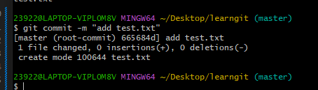

commit可以一次提交很多文件，所以你可以多次add不同的文件  

---

## 时光机穿梭  

查看工作区的状态，查看修改内容  

### 查看是否修改

```git
git status 让我们时刻掌握仓库当前的状态
```

比如说我将test.txt中的内容修改，但是没有提交：

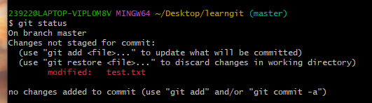  

### 查看修改的内容

```git
git diff 查看修改的内容
git diff test.txt  查看test.txt 修改了什么内容
```

---

## 提交修改  

提交修改和提交新文件一样  

```git
git add test.txt 添加
git status 查看当前仓库的状态
git commit -m "add" 提交到库中
git status 查看当前仓库的状态
```

---

## 版本回退  

```git
git log 查看之前的记录
git reflog 查看未来的记录
```

### 查看历史记录  

`git log 查看历史记录`  

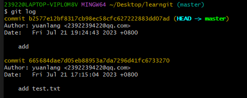  

### 修改输出内容  

`git log --pretty=oneline 只输出commit id`

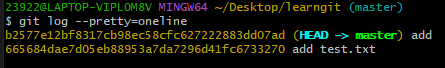

### 回退

```git  
git reset --hard HEAD^ 回退到上一个版本 
git reset --hard <commit id> 看commit id的前几位
回退到上上个版本就为HEAD^^,回退到上100个版本就为HEAD~100

再使用cat查看文件中的内容
cat test.txt

git reflog 查看未来的版本
git reset --hard <commit id> 看未来的commit id的前几位
```  

---

## 工作区和缓冲区  

### 工作区  

我的test文件夹就是一个工作区：

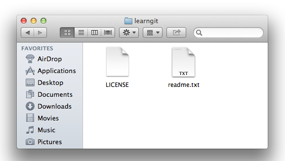  

### 缓冲区  

```git
用git add把文件添加进去，实际上就是把文件修改添加到暂存区(stage/index)
用git commit提交更改，实际上就是把暂存区的所有内容提交到当前分支
```

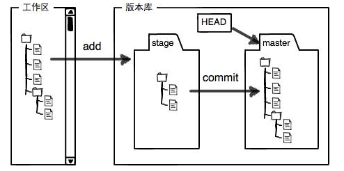  

---

## 撤销修改

```git
当readme.txt自修改后还没有被放到暂存区，现在，撤销修改就回到和版本库一模一样的状态
git checkout -- test.txt 丢弃工作区的修改

readme.txt已经添加到暂存区后，又作了修改，现在，撤销修改就回到添加到暂存区后的状态
git reset HEAD test.txt  先把暂存区的修改回退到工作区
git checkout -- test.txt 丢弃工作区的修改
```  

**小结**:

```git
场景1：当你改乱了工作区某个文件的内容，想直接丢弃工作区的修改时，用命令git checkout -- file。

场景2：当你不但改乱了工作区某个文件的内容，还添加到了暂存区时，想丢弃修改，分两步，第一步用命令git reset HEAD <file>，就回到了场景1，第二步按场景1操作。

场景3：已经提交了不合适的修改到版本库时，想要撤销本次提交，参考版本回退一节，不过前提是没有推送到远程库。
```  

---

## 删除文件  

**文件管理器中的删除**：

```git
添加test2.txt
cp test.txt test2.txt
git add test2.txt
git commit -m "add test2/txt"

文件管理器中的删除
rm test2.txt

```

在文件管理器中删除后，使用`git status`命令会告诉你那些文件被删除了

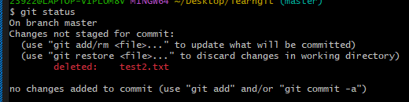  

**两种选择**：
一是确实要从版本库中删除该文件，那就用命令`git rm`删掉，并且`git commit`，将文件从版本库中删除：

```git
git rm test2.txt 告诉缓冲区
git commit -m "delete test2.txt" 将test2.txt从版本库中删除
```

另一种情况是删错了，因为版本库里还有呢，所以可以很轻松地把误删的文件恢复到最新版本：

```git
git checkout --test2.txt 版本库中的还原回来
```

---

## 远程仓库  

使用`github`当做远程仓库  

**创建SSH Key**，在用户主目录下，看看有没有.ssh目录，如果有，再看看这个目录下有没有id_rsa和id_rsa.pub这两个文件，如果已经有了，可直接跳到下一步。如果没有，打开Shell（Windows下打开Git Bash），创建SSH Key：
`ssh -keygen -t rsa -C "2392239422@qq.com"`  

**Add SSH Key**，在github上添加``.ssh`中的`id_rsa.pub`的文件内容  

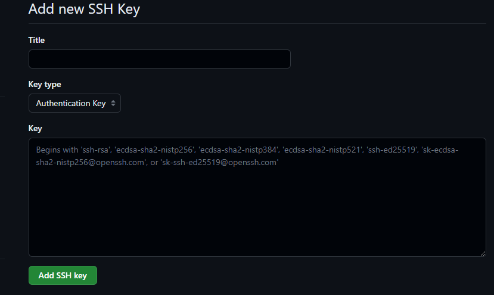  

**为什么GitHub需要SSH Key呢？因为GitHub需要识别出你推送的提交确实是你推送的，而不是别人冒充的，而Git支持SSH协议，所以，GitHub只要知道了你的公钥，就可以确认只有你自己才能推送。**  

**添加远程仓库**：
已经建立好远程仓库  


可以从这个仓库克隆出新的仓库，也可以把一个已有的本地仓库与之关联，然后，把本地仓库的内容推送到GitHub仓库。

### 关联本地仓库

先创建本地仓库后，再创建远程仓库后，将本地仓库和远程仓库关联  

```git
git remote add origin git@github.com:yuanlang1/test.git 关联本地库
git push -u origin master 把本地库的所有内容推送到远程库master分支上
```  

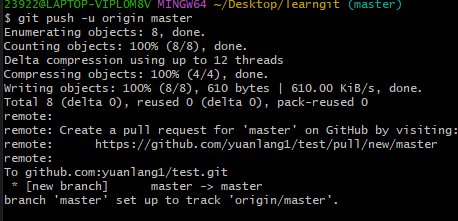  

### 从远程库克隆  

先建立远程仓库后，从远程仓库克隆，克隆前需要找到仓库的地址(SSH 或 https)

```git
git clone <SSH Key> 使用SSH将远程仓库克隆到本地库
例如：
git clone git@github.com:yuanlang1/test.git
```  

---

## 分支管理  

`HEAD`指向的就是**当前分支**  

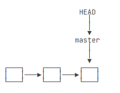  

我们创建新的分支，例如`dev`时，Git新建了一个指针叫`dev`，指向`master`相同的提交，再把`HEAD`指向dev，就表示当前分支在`dev`上:  

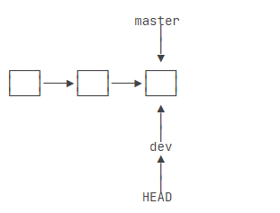  

### 查看分支

```git
git branch 查看已有的分支
```  

$*$代表当前分支是那个

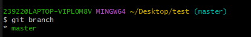

### 创建分支  

```git
git branch dev 创建dev分支
```

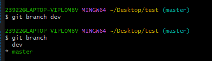

### 切换分支

```git
git checkout dev 切换分支
git switch dev 切换分支 ---> 更好理解
```  

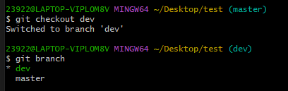  

### 创建并切换分支

```git
git checkout -b dev 加上-b,创建并切换分支
即该命令为： git branch dev + git checkout dev

git switch -c dev 创建并切换分支
即该命令为：git branch dev + git switch dev
```  

### 合并分支

合并分支之前，要看当前分支  

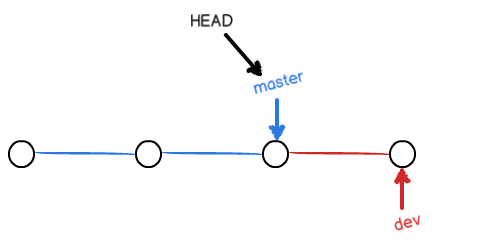

```git
git merge dev 将指定的分支合并当前分支上面，所以合并之前需要看当前分支是哪个
```  

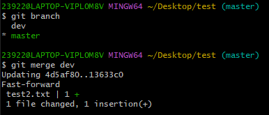  

### 删除分支  

```git
git branch -d dev 将dev分支删除
```

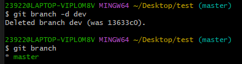  

---

## 解决冲突  

当在超前分支上面去切换到落后上，自动提示我们当前master分支比远程的master分支要超前

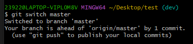  

当我切换到merge分支上后，添加东西后，提交：

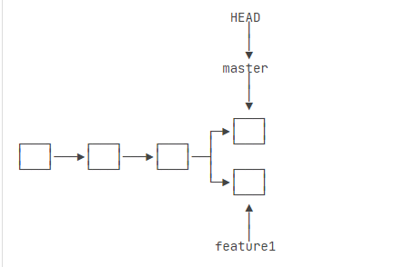  

Git无法执行“快速合并”，只能试图把各自的修改合并起来，但这种合并就可能会有冲突

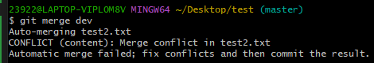

通过`git status`可以看见冲突文件

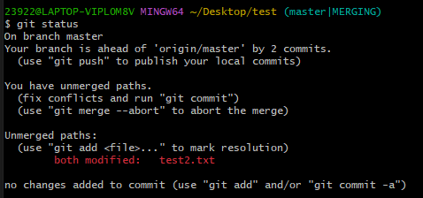  

通过`cat <file>`看文件中的冲突内容  
Git用`<<<<<<<，=======，>>>>>>>`标记出不同分支的内容

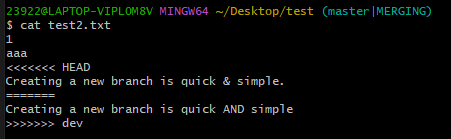  

根据提示后修改，再提交

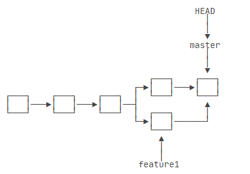

通过`git log --graph`查看合并情况

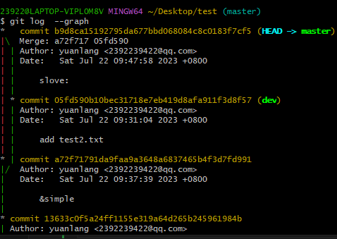  

---

## 分支管理策略

合并分支时，如果可能，Git会用Fast forward模式，但这种模式下，删除分支后，会丢掉分支信息。
要强制禁用Fast forward模式，Git就会在merge时生成一个新的commit，这样，从分支历史上就可以看出分支信息  

```git {.line-numbers}
git merger --no-ff -m "merger" dev  创建一个新的commit
--no-f 是禁用Fast forward模式 

通过git log就可以看到分支记录
```

---

## Bug分支

当手头工作没有完成时，需要去修复Bug，所以需要建立新的分支，然后合并，最后删除，那我的没完成的工作该怎么办?
> 当手头工作没有完成时，先把工作现场git stash一下，然后去修复bug，修复后，再git stash   pop，回到工作现场  

### 储藏工作现场

```git
git stash 将工作现场储藏起来，当Bug修复完成后继续工作
```  

工作区就会被清空，工作区被存储起来了

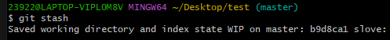  

查看之前的工作区

```git
git status list 用于查看之前的工作区
```

当创建一个新的分支来处理Bug后，合并时可以禁用Fast forward模式，因为查看分支，用于该修复的Bug合并到其他分支上面

```git
git merge --no-ff -m "solve bug" dev 将修改后的内容合并到当前分支上
```  

### 回到之前的工作  

当修复完Bug后，回到之前的工作

```git
git stash pop 恢复的同时把stash内容也删了
```

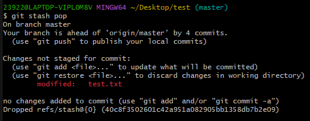  

当你想把该次Bug修复同步到其他分支上时，就需要之前的禁用Fast forward模式，然后通过`git cherry-pick`命令将Bug提供的修改‘复制’到当前分支上面

```git
git cherry-pick <commit id> 将Bug提交的那次commit合并到当前分支上面
```  

---

## 多人协作

> 查看远程库信息，使用git remote -v；
> 本地新建的分支如果不推送到远程，对其他人就是不可见的；
> 从本地推送分支，使用git push origin branch-name，如果推送失败，先用git pull抓取远程的>新提交；
> 在本地创建和远程分支对应的分支，使用git checkout -b branch-name origin/branch-name，>本地和远程分支的名称最好一致；
> 建立本地分支和远程分支的关联，使用git branch --set-upstream branch-name origin/branch-name；
> 从远程抓取分支，使用git pull，如果有冲突，要先处理冲突。

### 查看远程库的信息

```git
git remote 查看远程库的信息 
git remote -v 显示更详细的信息
```  

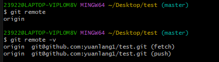  

### 推送分支  

推送分支，就是把该分支上的所有本地提交推送到远程库。推送时，要指定本地分支，这样，Git就会把该分支推送到远程库对应的远程分支上  

将该分支上面的所有本地提交推送到远端，推送时要指定本地分支

```git
git push origin master 推送到远端的master上
```  

### 抓取分支  

远程库clone时，默认情况下，你的小伙伴只能看到本地的master分支

要在`dev`分支上开发，就必须创建远程`origin`的`dev`分支到本地，即需要创建本地的dev分支

```git
git checkout -b dev origin/dev 创建本地dev分支，并与远端的dev关联
```  

当有人比你先提交，并且修改了与你相同的文件，推送会失败  
**怎么解决?**
> 先用git pull把最新的提交从origin/dev抓下来，然后，在本地合并，解决冲突，再推送

当指定的本地`dev`分支没有与远端的`dev`分支关联时，`git pull`会出现错误

```git
git branch --set-upstream-to=origin/dev dev 设置dev和origin的链接
```  

然后`pull`出现错误，合并有冲突，就需要手动解决，解决后，提交后`push`

### 多人协作的工作模式

1. 首先，可以试图用`git push origin <branch-name>`推送自己的修改；
2. 如果推送失败，则因为远程分支比你的本地更新，需要先用`git pull`试图合并；
3. 如果合并有冲突，则解决冲突，并在本地提交；
4. 没有冲突或者解决掉冲突后，再用`git push origin <branch-name>`推送就能成功！

---

## Rebase

rebase操作可以把本地未push的分叉提交历史整理成直线

```git
git rebase 
```  
