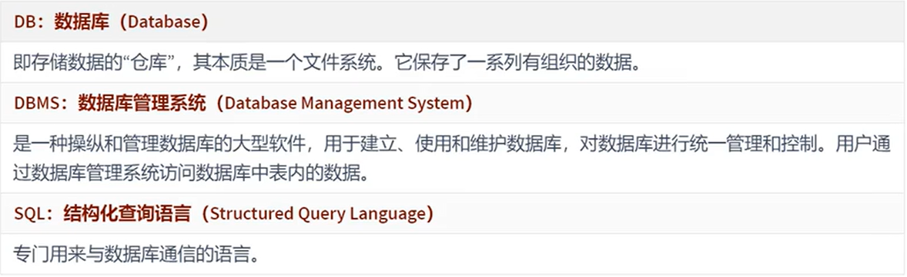
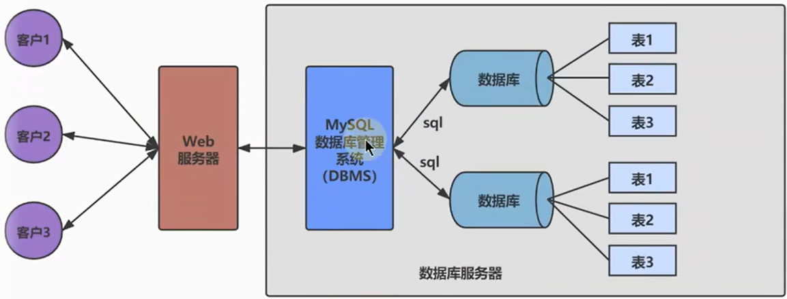
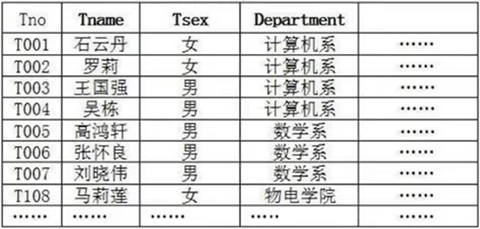
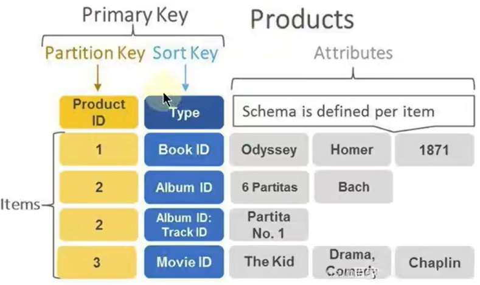
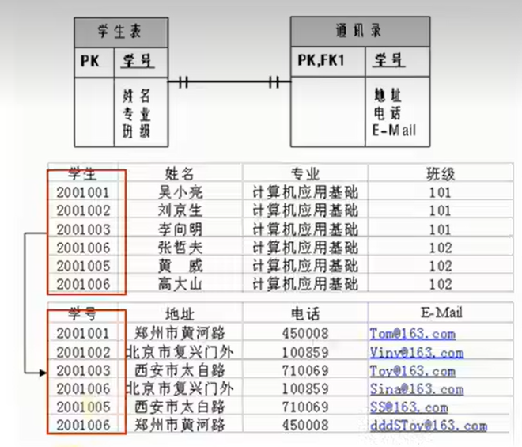
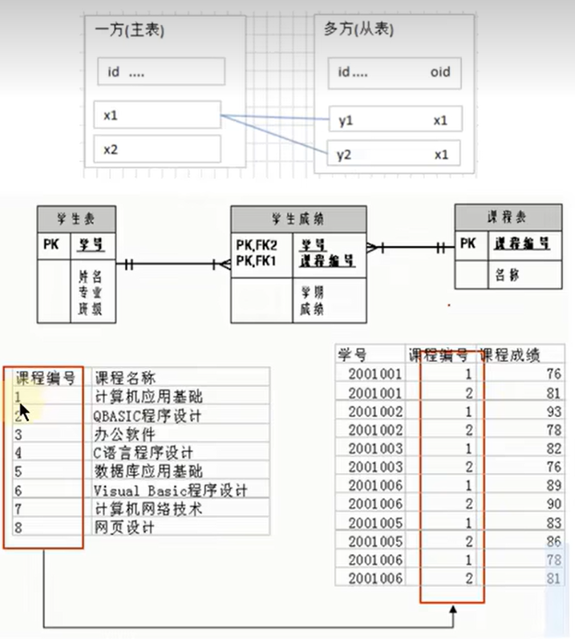
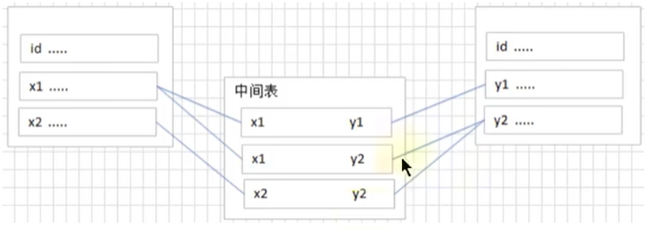
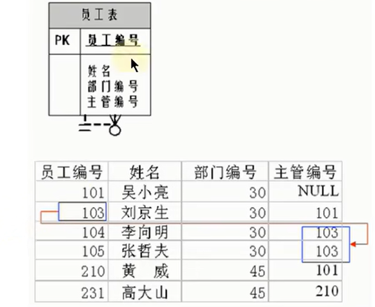
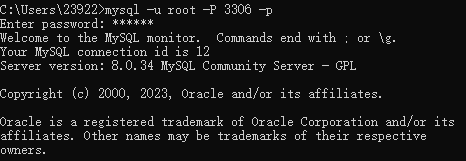
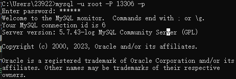

# 数据库概述

## 数据库和数据库管理系统  

---

### 数据库的概念  

  

---

### 数据库和数据库管理系统的关系  

  

  

---

## RDBMS与非RDBMS  

### 关系型数据库(RDBMS)  

  

关系型数据库以列和行的形式存储数据，行+列 ->  表(table)  
关系型数据库建立在**关系模型**基础上的数据库  

  

* 复杂查询
  可以用sql语句进行单表或多表中之间做复杂的数据查询  

* 事务支持

---

### 非关系型数据库(非RDBMS)  

基于键值对存储数据，不通过SQL层的解析，性能高  

#### 键值型数据库  

Key-Value键值方式存储数据，查找速度快，但是无法进行条件过滤  

  

#### 文档型数据库  

特别的Key-Value，存放的值为文档  

#### 搜索引擎数据库  

爬取数据-->特定的格式

#### 图形数据库  

图形关系的进行存储，结点和边  

---

## 关系型数据库设计规则  

* 关系型数据库的典型数据结构为**数据表**  
* 数据存放到表中，表存在库中
* 一个库有多个表，表名有唯一性

### 表，记录，字段  

```c++
表 --> 类 
记录 --> 对象 
列 --> 字段，属性 
```

  

---

### 表的关联关系  

#### 一对一  

常用信息一个表，不常用信息一个表，相互对应

**原则**：主表的主键和从表的外键(唯一)，形成主外键关系  

  

#### 一对多  

客户表和订单表，分类表和商品表...  

**原则**：在从表(多方)创建一个字段，字段作为外键指向主表(一方)的主键  

  

#### 多对多  

要表示多对多关系，必须创建联接表，将多对多关系划分为两个一对多关系  

  

**例如**：

* 学生信息表：一行代表一个学生的信息  
* 课程信息表：一行代表一门课程的信息  
* 选课信息表：一个学生可以选多门课，一门课可以被多个学生选择 $--->$ 联接表  

#### 自我引用  

  

---

### 登录MySQL  

#### 自带的客户端登录  

#### windows命令行登录  

```Linux
mysql -u root -P 3306  -h localhost -p  --> -u指用户 -P指端口号 -h指指定IP -p指密码
例如:
mysql -u root -P 3306 -p 登录端口号为3306的mysql
```

**登录8.0**：

  

**登录5.7**：



#### 退出登录  

`quit/exit`  

---
