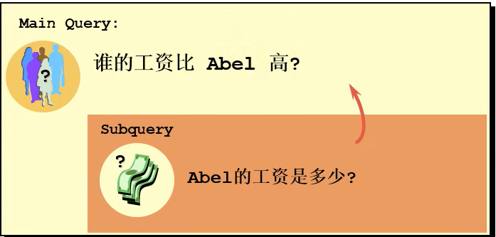

# 需求分析和问题解决

- [需求分析和问题解决](#需求分析和问题解决)
  - [1. 实际问题](#1-实际问题)
  - [2. 子查询的语法](#2-子查询的语法)
  - [3. 分类](#3-分类)

---

## 1. 实际问题



---

## 2. 子查询的语法

```sql
select last_name
from employees
where salary > (
                 select ...
               )
```

---

## 3. 分类

```sql
角度1： -> 从内查询返回的条目数
单行子查询 vs 多行子查询  

角度2： -> 从内查询是否被执行多次
相关子查询 vs 不相关子查询
```

---
