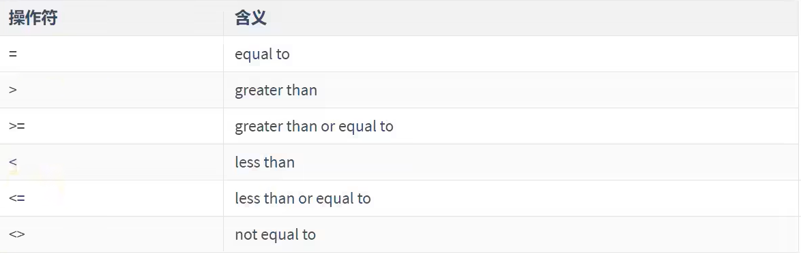

# 单行子查询

## 1. 单行比较操作符



## 2. 练习

```sql
1. 查询工资大于149号员工工资的员工的信息
select * 
from employees
where salary > (
                select salary 
                from employees
                where employee_id=149    
                );


2. 返回job_id与141号员工相同，salary比143号员工多的员工姓名，job_id和工资
select last_name,job_id,salary
from employees
where job_id = (
               select job_id
               from employees
               where employee_id=141
               )
and salary > (
                select salary
                from employees
                where employee_id=143
            );


3. 返回公司工资最少的员工的last_name,job_id和salary
select last_name,job_id,salary
from employees
where salary = (
                select MIN(salary)
                from employees
                );


4. 查询与141号员工的manager_id和department_id相同的其他员工的employee_id，manager_id,department_id
select employee_id,manager_id,department_id
from employees
where manager_id = (
                    select manager_id 
                    from employees
                    where employee_id =141
                    )
and department_id = (
                      select department_id
                      from employees
                      where employee_id =141
                    )
and employee_id <> 141;


5. 查询最低工资大于50号部门最低工资的部门id和其最低工资  -> group by + having
select department_id,MIN(salary)
from employees
where department_id is not NULL
group by department_id
having MIN(salary) > (
                        select MIN(salary)
                        from employees
                        where department_id=50
                    );


6. 显示员工的employee_id,last_name,location,其中若员工department_id与location_id为1800的department_id相同，则location为'Canada'，其余为'USA'
select employee_id,last_name,(case department_id when (select department_id from departments  where location_id=1800) then "Canada"
                              else "USA" end) "location"
from  employees;
``` 
