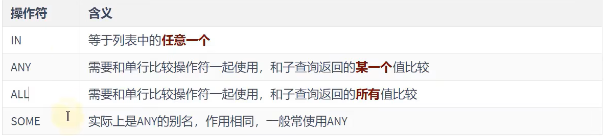

# 多行子查询

```sql
集合比较子查询
内查询返回多行
```

---

## 1. 多行子查询比较操作符



---

## 2. 练习

### 2.1 返回其他`job_id`中比`job_id`为`IT_PROG`部门任一工资低的员工的员工号，姓名，`job_id`以及`salary`

```sql
select employee_id,last_name,job_id,salary
from employees
where job_id <> "IT_PROG"
and salary < any (
                select salary
                from employees
                where job_id="IT_PROG"
                );
```

### 2.2 返回其他`job_id`中比`job_id`为`IT_PROG`部门所有工资低的员工的员工号，姓名，`job_id`以及`salary`

```sql
select employee_id,last_name,job_id,salary
from employees
where job_id != "IT_PROG"
and salary < all (
                    select salary
                    from employees
                    where job_id="IT_PROG"
                 );
```

### 2.3 查询平均工资最低的部门的`id`

`MySQL`**中聚合函数不能嵌套使用**

```sql
方式1：
select department_id
from employees
group by department_id
having AVG(salary) = (
                    select min(avg_sal)
                    from (
                        select AVG(salary) avg_sal
                        from employees
                        group by department_id
                    ) dept_avg_sal
                );

方式2：
select department_id
from employees
group by department_id
having AVG(salary) <= all (
                    select AVG(salary) avg_sal
                    from employees
                    group by department_id
                    );
```

---

## 3. 空值问题

```sql
内查询中要注意是否返回NULL
```

---
