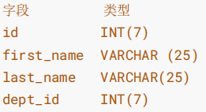
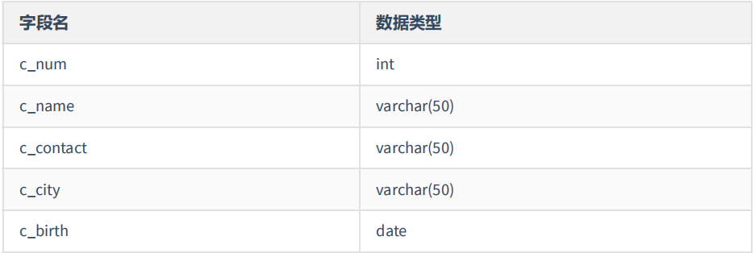
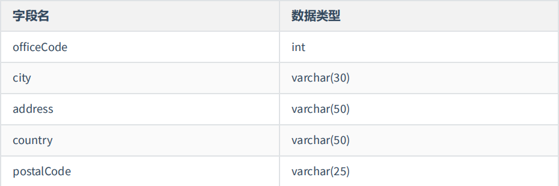
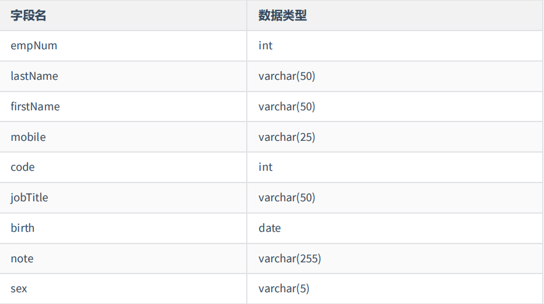

# 练习

- [练习](#练习)
  - [1. 练习1](#1-练习1)
    - [1.1 创建数据库test01\_office,指明字符集为utf8。并在此数据库下执行下述操作](#11-创建数据库test01_office指明字符集为utf8并在此数据库下执行下述操作)
    - [1.2 创建表dept01 字段为：`id INT(7)` `NAME VARCHAR(25)`](#12-创建表dept01-字段为id-int7-name-varchar25)
    - [1.3 将表departments中的数据插入新表dept02中](#13-将表departments中的数据插入新表dept02中)
    - [1.4 创建表emp01](#14-创建表emp01)
    - [1.5 将列last\_name的长度增加到50](#15-将列last_name的长度增加到50)
    - [1.6 根据表employees创建emp02](#16-根据表employees创建emp02)
    - [1.7 删除表emp01](#17-删除表emp01)
    - [1.8 将表emp02重命名为emp01](#18-将表emp02重命名为emp01)
    - [1.9 在表dept02和emp01中添加新列test\_column，并检查所作的操作](#19-在表dept02和emp01中添加新列test_column并检查所作的操作)
    - [1.10 直接删除表emp01中的列 department\_id](#110-直接删除表emp01中的列-department_id)
  - [2. 练习2](#2-练习2)
    - [2.1 创建数据库`test02_market`](#21-创建数据库test02_market)
    - [2.2 创建数据表 customers](#22-创建数据表-customers)
    - [2.3 将 c\_contact 字段移动到 c\_birth 字段后面](#23-将-c_contact-字段移动到-c_birth-字段后面)
    - [2.4 将 c\_name 字段数据类型改为 varchar(70)](#24-将-c_name-字段数据类型改为-varchar70)
    - [2.5 将c\_contact字段改名为c\_phone](#25-将c_contact字段改名为c_phone)
    - [2.6 增加c\_gender字段到c\_name后面，数据类型为char(1)](#26-增加c_gender字段到c_name后面数据类型为char1)
    - [2.7 将表名改为customers\_info](#27-将表名改为customers_info)
    - [2.7 删除字段c\_city](#27-删除字段c_city)
  - [练习3](#练习3)
    - [3.1 创建数据库test03\_company](#31-创建数据库test03_company)
    - [3.2 创建表offices](#32-创建表offices)
    - [3.3 创建表employees](#33-创建表employees)
    - [3.4 将表employees的mobile字段修改到code字段后面](#34-将表employees的mobile字段修改到code字段后面)
    - [3.5 将表employees的birth字段改名为birthday](#35-将表employees的birth字段改名为birthday)
    - [3.6 修改sex字段，数据类型为char(1)](#36-修改sex字段数据类型为char1)
    - [3.7 删除字段note](#37-删除字段note)
    - [3.8 增加字段名favoriate\_activity，数据类型为varchar(100)](#38-增加字段名favoriate_activity数据类型为varchar100)
    - [3.9 将表employees的名称修改为 employees\_info](#39-将表employees的名称修改为-employees_info)

---

## 1. 练习1

### 1.1 创建数据库test01_office,指明字符集为utf8。并在此数据库下执行下述操作

```sql
create database if not exists test01_office character set 'utf8';
```

### 1.2 创建表dept01 字段为：`id INT(7)` `NAME VARCHAR(25)`

```sql
use test01_office;

create table dept01(
                    id int(7),
                    NAME varchar(25)
                   );
```

### 1.3 将表departments中的数据插入新表dept02中

```sql
create table dept02
as
select *
from atguigudb.departments;
```

### 1.4 创建表emp01



```sql
create table emp01(
                    id int(7),
                    first_name varchar(25),
                    last_name varchar(25),
                    dept_id int(7)
                  );
```

### 1.5 将列last_name的长度增加到50

```sql
alter table emp01
modify last_name varchar(50);
```

### 1.6 根据表employees创建emp02

```sql
create table emp02
as
select * 
from employees;
```

### 1.7 删除表emp01

```sql
drop table if exists emp01;
```

### 1.8 将表emp02重命名为emp01

```sql
rename table emp02 to emp01;
```

### 1.9 在表dept02和emp01中添加新列test_column，并检查所作的操作

```sql
alter table dept02
add test_column varchar(10);

desc dept02;

alter table emp01
add test_column varchar(10);

desc emp01;
```

### 1.10 直接删除表emp01中的列 department_id

```sql
alter table emp01
drop column department_id;
```

---

## 2. 练习2

### 2.1 创建数据库`test02_market`

```sql
create database if not exists test02_market character set 'utf-8';
```

### 2.2 创建数据表 customers



```sql
use test02_market;
create table customers(
                        c_num int
                        c_name varchar(50)
                        c_contact varchar(50)
                        c_city varchar(50)
                        c_birth date
                      );
```

### 2.3 将 c_contact 字段移动到 c_birth 字段后面

```sql
alter table customers
modify c_contact varchar(50) after c_birth;
```

### 2.4 将 c_name 字段数据类型改为 varchar(70)

```sql
alter table customers
modify c_name varchar(70); 
```

### 2.5 将c_contact字段改名为c_phone

```sql
alter table customers
change c_contact c_phone varchar(50);
```

### 2.6 增加c_gender字段到c_name后面，数据类型为char(1)

```sql
alter table customers
add c_gender char(1) after c_name;
```

### 2.7 将表名改为customers_info

```sql
rename table customers to customers_info;
```

### 2.7 删除字段c_city

```sql
alter table customers_info
drop column c_city;
```

---

## 练习3

### 3.1 创建数据库test03_company

```sql
create database if not exists test03_company character set 'utf-8';
```

### 3.2 创建表offices



```sql
create table  offices(
                        officeCode int,
                        city varchar(30),
                        address varchar(50),
                        country varchar(50),
                        postalCode varchar(25)
                     );
```

### 3.3 创建表employees



```sql
create table employees(
                        empNum int,
                        lastName varchar(50),
                        firstName varchar(50),
                        mobile varchar(25),
                        code int,
                        jobTitle varchar(50),
                        birth date,
                        note varchar(255),
                        sex varchar(5)
                      );
```

### 3.4 将表employees的mobile字段修改到code字段后面

```sql
alter table employees
modify mobile varchar(25) after code;
```

### 3.5 将表employees的birth字段改名为birthday

```sql
alter table employees
change birth birthday date;
```

### 3.6 修改sex字段，数据类型为char(1)

```sql
alter table employees
modify sex char(1);
```

### 3.7 删除字段note

```sql
alter table employees
drop column note;
```

### 3.8 增加字段名favoriate_activity，数据类型为varchar(100)

```sql
alter table employees
add favoriate_activity varchar(100);
```

### 3.9 将表employees的名称修改为 employees_info

```sql
rename table employees to employees_info;
```
