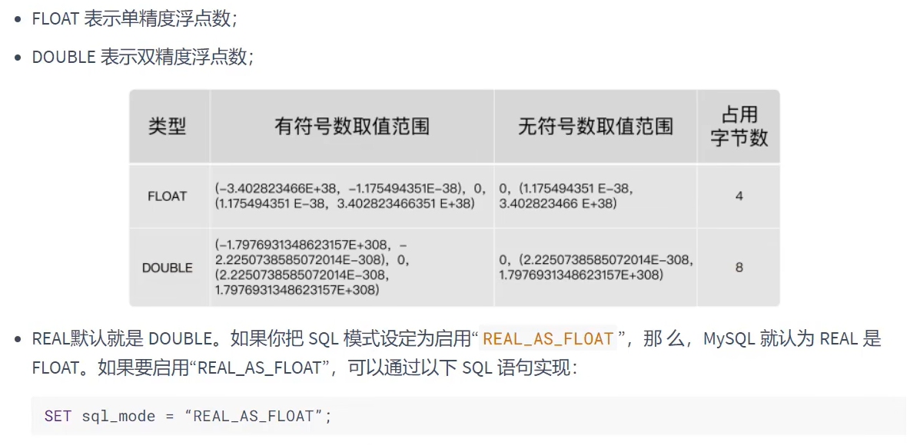
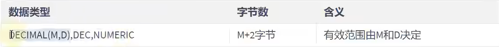
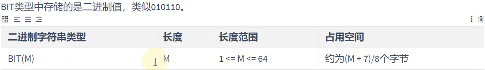

# 浮点，定点，位类型

---

## 1. 浮点类型

### 1.1 类型介绍



---

### 1.2 精度说明

```sql
float(M,D) double(M,D)
M为精度，D为标度  M=整数位+小数位   D=小数位
```

---

## 2. 定点类型

### 2.1 类型介绍



```sql
最大取值范围与double相同

没有指定精度和标度  默认位decimal(10,0)
```

### 2.2 浮点数 `vs` 定点数

```sql
浮点数 -> 取值范围大，不精准
定点数 -> 取值范围相对较小，精准
```

---

## 3. 位类型

### 3.1 类型说明



```sql
当没有指定长度时，默认为bit(1)
```

---
