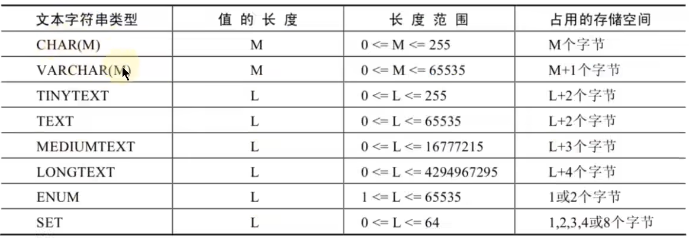
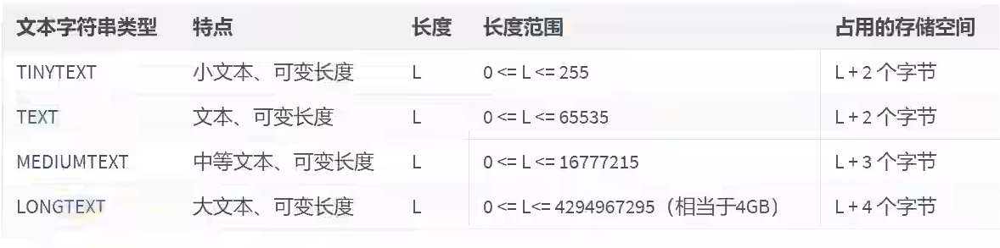
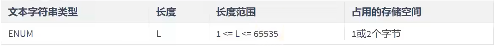
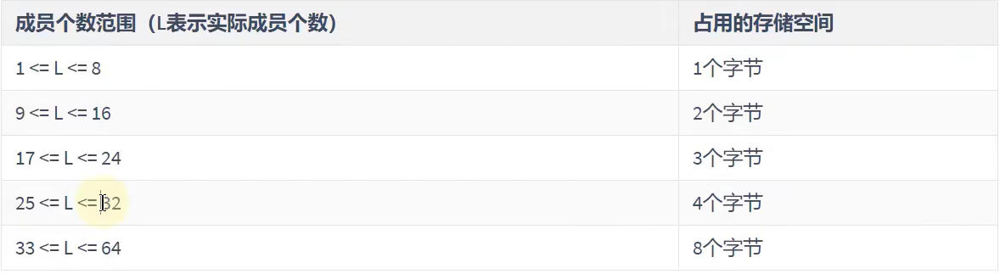
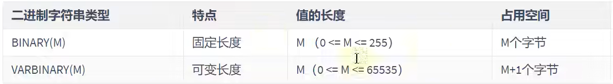
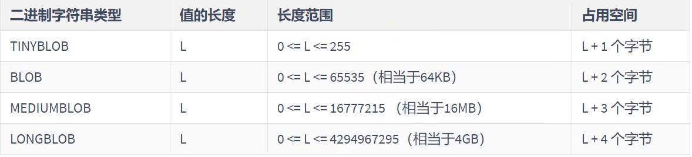

# 其他类型

- [其他类型](#其他类型)
  - [1.文本字符串类型](#1文本字符串类型)
  - [2. `enum`类型](#2-enum类型)
  - [3. `set`类型](#3-set类型)
  - [4. 二进制字符串类型](#4-二进制字符串类型)
  - [5. `BLOB`类型](#5-blob类型)
  - [6. `JSON`类型](#6-json类型)
  - [7. 建议](#7-建议)

---

## 1.文本字符串类型





```sql
text 不能作为主键 -> 存储长度不定
```

---

## 2. `enum`类型

又称枚举类型



```sql
create table test_enum(
                        season enum('春','夏','秋','冬','unknown') -> 指定枚举值
                      );
insert into test_enum
values ('冬'),(1),('2'); -> 指定下标或值 从枚举值中选一个 
```

## 3. `set`类型



```sql
create table test_set(
                        s set('a','b','c')  -> 指定枚举值
                     );
insert into test_set
values ('a,b,c,a'); 自动过滤重复的 从枚举值中选择   
结果：
+-------+
| s     |
+-------+
| a,b,c |  -> 自动过滤重复的
+-------+
```

---

## 4. 二进制字符串类型



---

## 5. `BLOB`类型



可以存储图片视频等 -> **实际不会用**

通过导入图片的方式存储图片

---

## 6. `JSON`类型


---

## 7. 建议


---
