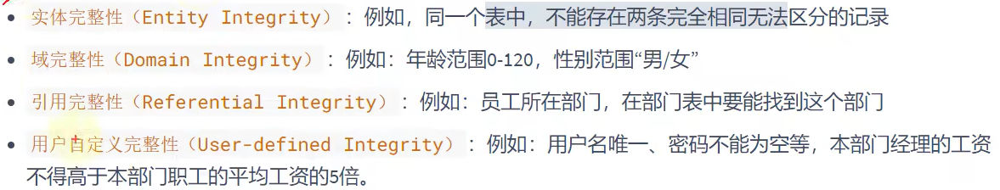

# 概述

- [概述](#概述)
  - [1. 约束的应用](#1-约束的应用)
  - [2. 约束的分类](#2-约束的分类)
  - [3. 如何增加约束](#3-如何增加约束)
  - [4. 如何查看约束](#4-如何查看约束)

---

## 1. 约束的应用



---

## 2. 约束的分类

```sql
根据约束数据列的限制：单列约束，多列约束

根据约束的作用范围：列级约束，表级约束

根据约束起的作用：
not null 非空约束
unique 唯一约束,规定某一字段在整个表中是唯一的
primary key 主键约束
foreign key 外键约束
check 检查约束
default 默认值约束  
```

---

## 3. 如何增加约束

```sql
create table 时 添加约束
alter table 时 增加约束或删除约束
```

---

## 4. 如何查看约束

```sql
select * from information_schema.table_constraints
where table_name='表名';

例如:
select * from information_schema.table_constraints
where table_name='employees';
```

---
