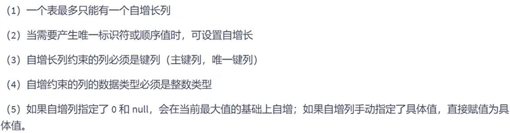

# 自增列

- [自增列](#自增列)
  - [1. 创建时添加](#1-创建时添加)
  - [2. `alter`添加](#2-alter添加)
  - [3. 删除自增](#3-删除自增)
  - [4. 自增初始化](#4-自增初始化)



---

## 1. 创建时添加

```sql
例如：
create table test(
                    id int primary key auto_increment, #自增列
                    name varchar(10),
                    age int
                 );

例如：
插入数据时，自动增长id的值  -> 不用赋值自增列
insert into test(name,age)
values('tom',18),
      ('lisa',20);  
```

---

## 2. `alter`添加

```sql
alter table test
modify id int auto_increment;
```

---

## 3. 删除自增

```sql
alter table test
modify id int;
```

---

## 4. 自增初始化

```sql
数据库重启后，计数器就从最大的重新计  数
```

---
