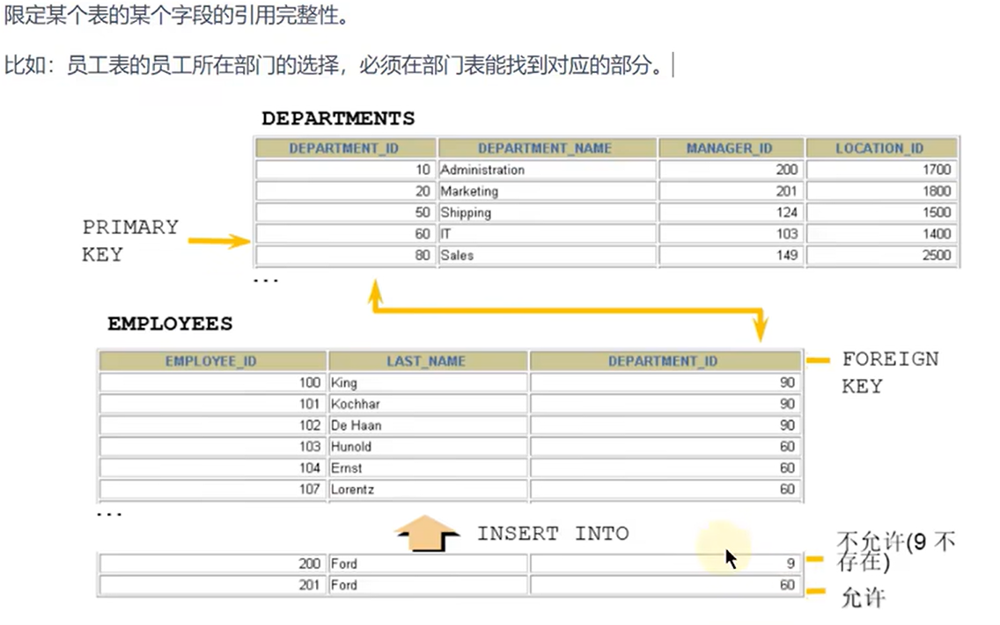

# 外键约束

- [外键约束](#外键约束)
  - [1. 作用](#1-作用)
  - [2. 添加外键](#2-添加外键)
    - [2.1 在`create table`时创建](#21-在create-table时创建)
    - [2.2 插入数据](#22-插入数据)
    - [2.3 `alter table`时添加](#23-alter-table时添加)
  - [3. 删除外键约束](#3-删除外键约束)

---

## 1. 作用

```sql
foreign key(从表约束) 
references 主表(主表约束)
```



## 2. 添加外键

**一个表中可以有多个外键约束**！

### 2.1 在`create table`时创建

```sql
#先创建主表
create table dept1(
                    dept_id int primary key,
                    dept_name varchar(15)
                  );
#再建从表
create table emp1(
                    emp_id int primary key auto_increment,
                    emp_name varchar(10),
                    department_id int,

                    #表级约束：
                    constraint fk_emp1_dept_id foreign key (department_id) references dept1(dept_id)
                 );

```

### 2.2 插入数据

主从表中的外键约束要对应

```sql
如果从表中主表中的部门，就需要再主表中添加新的部门
insert into dept1
values (10,'IT');

insert into emp1
values(101,'IT',10);
```

### 2.3 `alter table`时添加

```sql
alter table 从表名 
add [constraint 约束名] foreign key (从表字段) references 主表名(被引用字段)

例如:
alter table emp1
add constraint emp_dept_id_fk foreign key (dept_id) references dept(dept_id);
```


---

## 3. 删除外键约束

```sql
1. 查看约束名和删除外键约束
select * from information_schema.table_constraints where table_name='emp1'; 查看约束
alter table 从表名 drop foreign key 外键约束名;

2. 查看索引名和删除索引
show index from 表名称;
alter table 从表名 drop index 索引名;
```

```sql
例如：
select * from information_schema.table_constraints where table_name='emp1';

alter table emp1
drop foreign key fk_emp1_dept_id;

show index from emp1;

alter table emp1 
drop index fk_emp1_dept_id;
```

---
