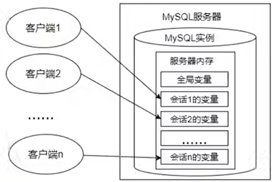

# 变量

---

## 1. 系统变量



---

## 2. 分类

```sql
全局系统变量
绘画系统变量
```

---

## 3. 查看

### 3.1 查看系统变量或部分变量

```sql
查看全局系统变量
show global variables;

查看会话系统变量
show session variables;
或
show variables;

查看条件的部分系统变量
show global variables like '%标识符%';

查看条件的部分系统变量
show session variables like '%标识符%';
```

### 3.2 查看指定变量

```sql
查看指定的系统变量
select @@global.变量名

查看指定的会话变量
select @@session.变量名
或
select @@变量名
```

---

## 4. 修改

```sql
方式1：
修改配置文件

方式2：
全局变量
set @@global.变量名=变量值
set global 变量名=变量值

会话变量
set @@session.变量名=变量值
或
set session 变量名=变量值
```

---
