# 单行函数

- [单行函数](#单行函数)
  - [1. 数值函数](#1-数值函数)
    - [1.1 基本函数](#11-基本函数)
    - [1.2 角度和弧度的转换](#12-角度和弧度的转换)
    - [1.3 三角函数](#13-三角函数)
    - [1.4 指数和对数](#14-指数和对数)
    - [1.5 进制间的转换](#15-进制间的转换)
  - [2. 字符串函数](#2-字符串函数)
  - [3. 日期和时间函数](#3-日期和时间函数)
    - [3.1 获取日期，时间](#31-获取日期时间)
    - [3.2 日期与时间戳的转换](#32-日期与时间戳的转换)
    - [3.3 获取月份，星期，星期天，天数等函数](#33-获取月份星期星期天天数等函数)
    - [3.4 日期操作函数](#34-日期操作函数)
    - [3.5 时间和秒钟的转换](#35-时间和秒钟的转换)
    - [3.6 计算日期和时间的函数](#36-计算日期和时间的函数)
    - [3.7 日期的格式化和解析](#37-日期的格式化和解析)
  - [4. 流程控制函数](#4-流程控制函数)
  - [5. 加密和解密函数](#5-加密和解密函数)
  - [6. `MySQL`信息函数](#6-mysql信息函数)
  - [7. 其他函数](#7-其他函数)

---

## 1. 数值函数

### 1.1 基本函数

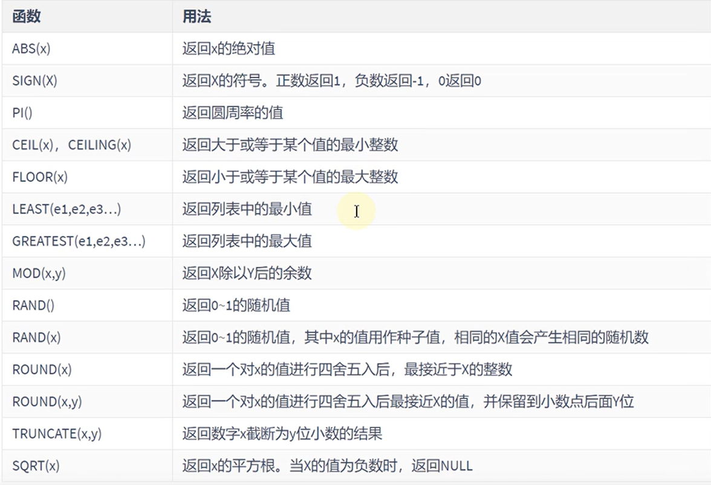

### 1.2 角度和弧度的转换

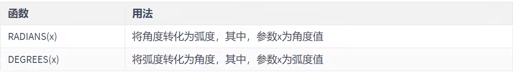

### 1.3 三角函数

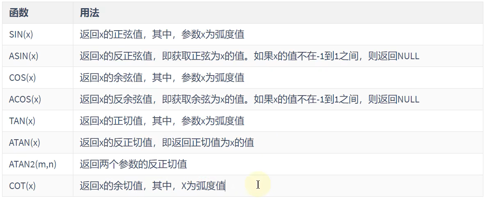

### 1.4 指数和对数

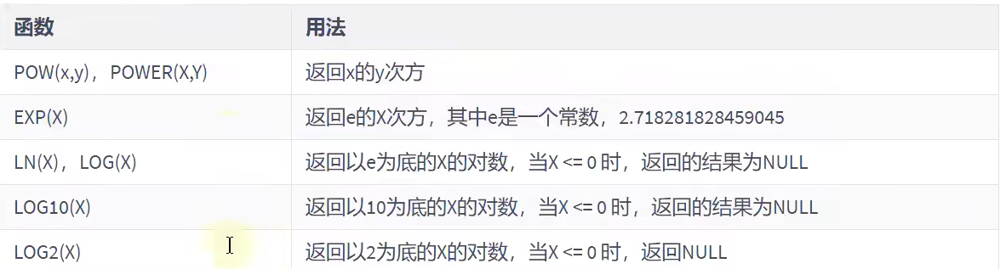

### 1.5 进制间的转换

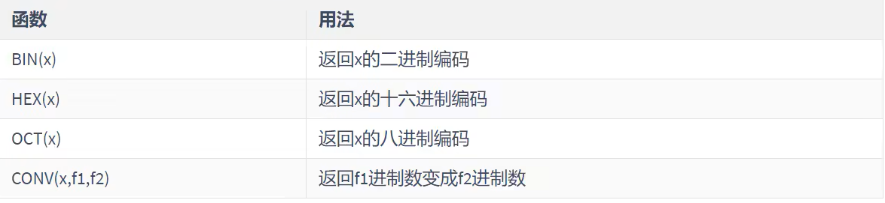

---

## 2. 字符串函数

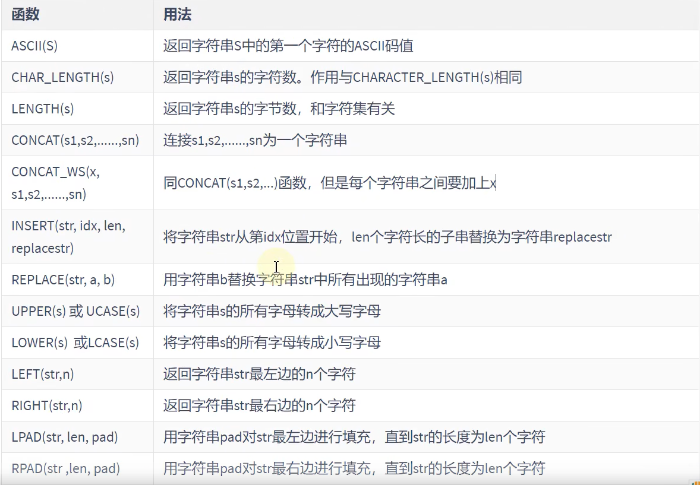

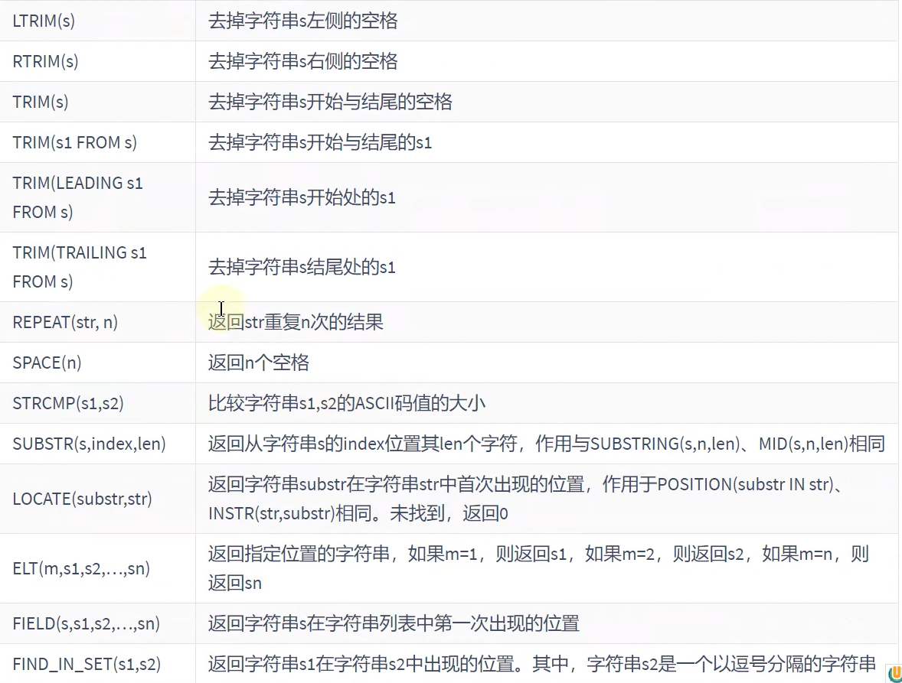

---

## 3. 日期和时间函数

### 3.1 获取日期，时间

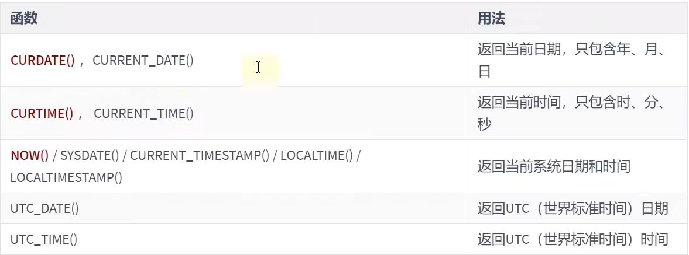‘

### 3.2 日期与时间戳的转换

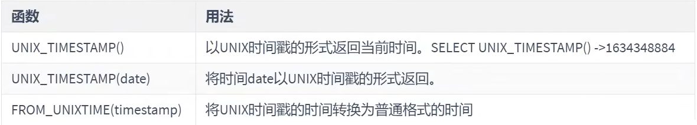

### 3.3 获取月份，星期，星期天，天数等函数

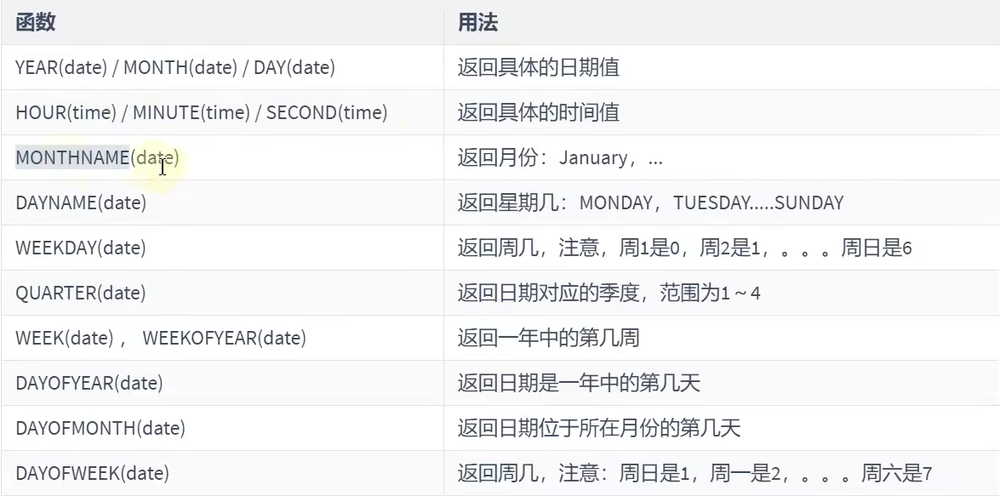

### 3.4 日期操作函数

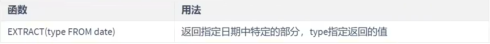

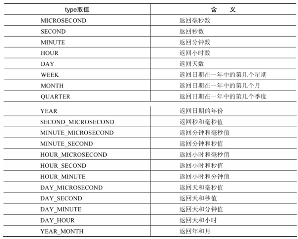

### 3.5 时间和秒钟的转换

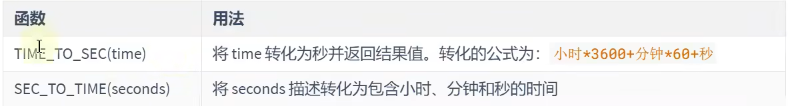

### 3.6 计算日期和时间的函数

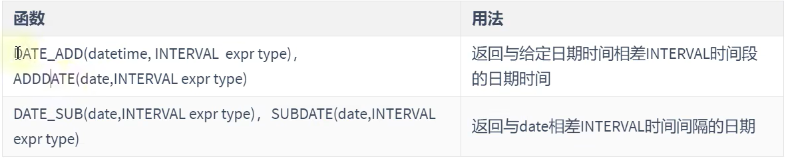

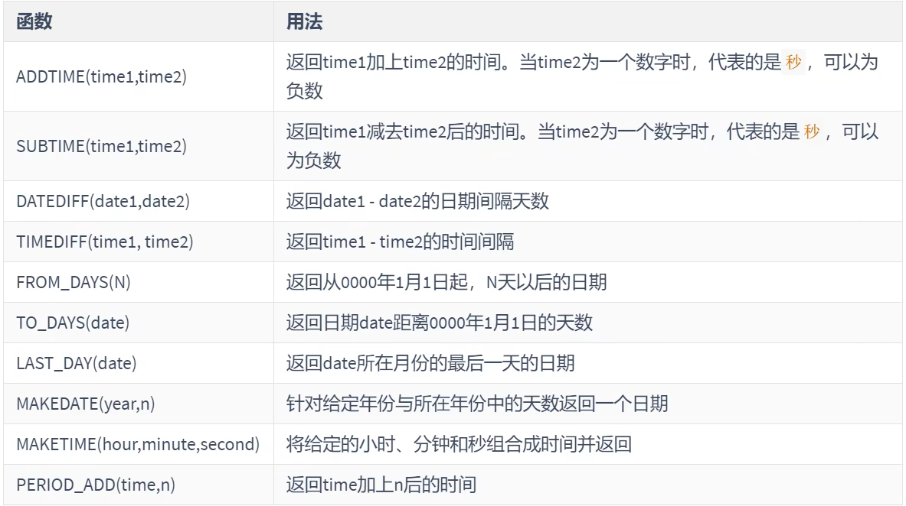

### 3.7 日期的格式化和解析


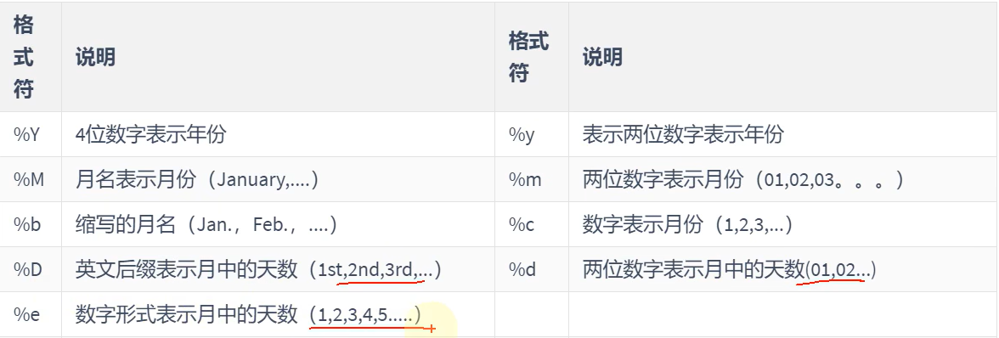

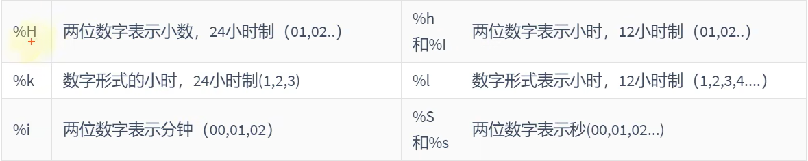

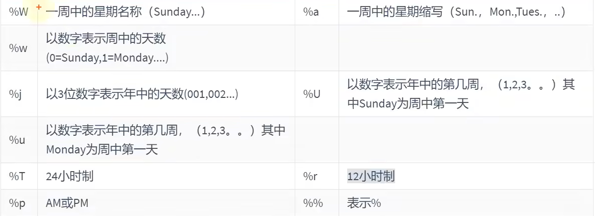

---

## 4. 流程控制函数

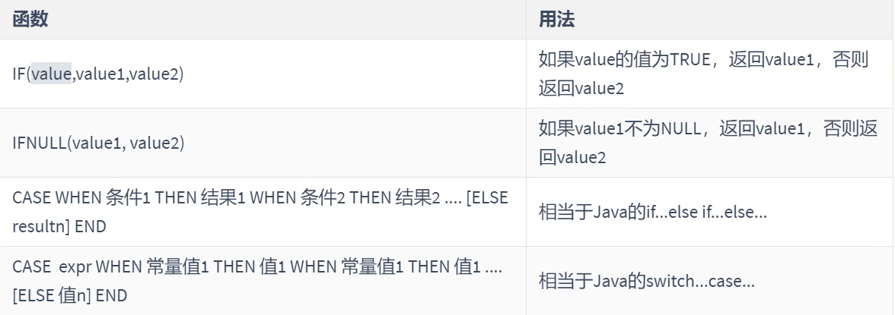

## 5. 加密和解密函数

```sql
password函数在MySQL8.0被弃用
```

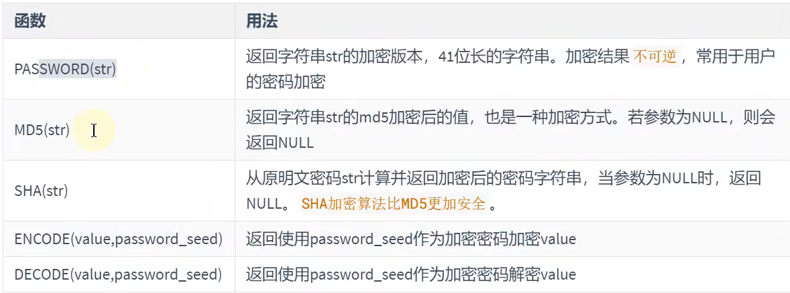

## 6. `MySQL`信息函数

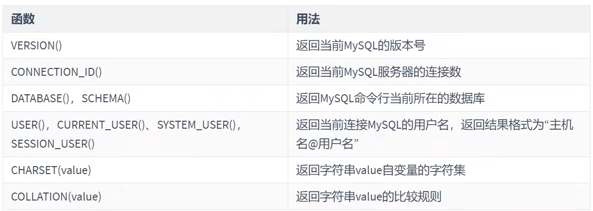

## 7. 其他函数

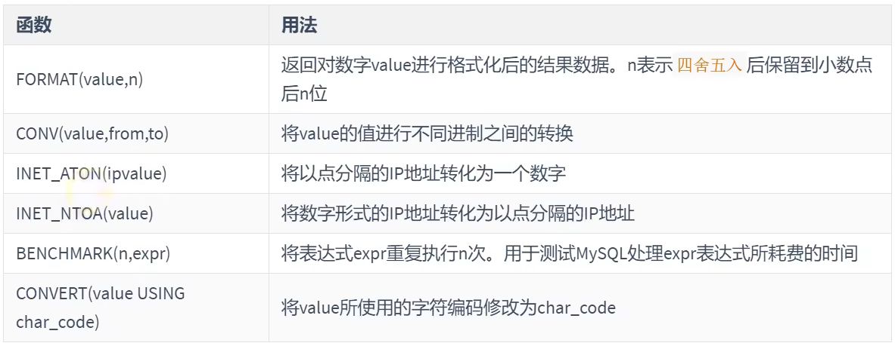
