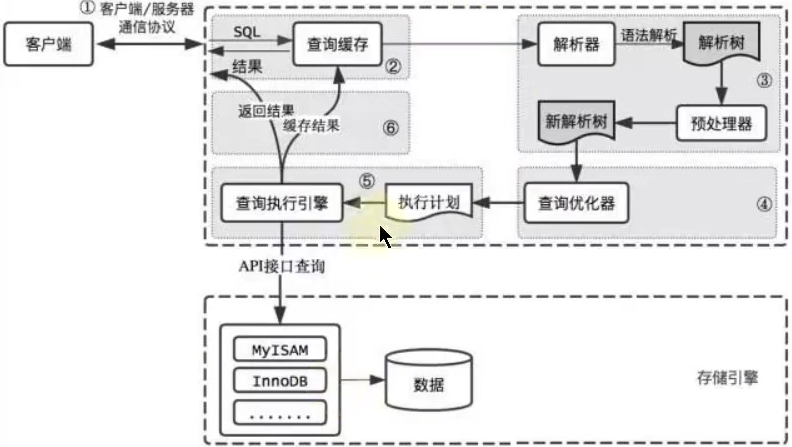

# SQL执行

- [SQL执行](#sql执行)
  - [1. SQL92语法](#1-sql92语法)
  - [2. SQL99函数](#2-sql99函数)
  - [3. 执行顺序](#3-执行顺序)

---

- [SQL执行](#sql执行)
  - [1. SQL92语法](#1-sql92语法)
  - [2. SQL99函数](#2-sql99函数)
  - [3. 执行顺序](#3-执行顺序)

---

## 1. SQL92语法

```sql
select ...,...,...(存在聚合函数)
from ...,...,...
where 多表连接条件 and 不包含聚合函数的过滤条件
group by ...,...
having 包含聚合函数的过滤条件
order by ...,...(asc/desc)
limit ...,...
```

---

## 2. SQL99函数

```sql
select ...,...,...(存在聚合函数)
from ...(left/right)join ... on 多表连接函数
(left/right)join ... on ...
where 不包含聚合条件的过滤条件
group by ...,...
having 包含聚合函数的过滤条件
order by ...,...(asc/desc)
limit ...,...
```

---

## 3. 执行顺序



```sql
from -> on -> (left/right) join -> where -> group by -> having -> select -> distinct -> order by -> limit 
```

---
