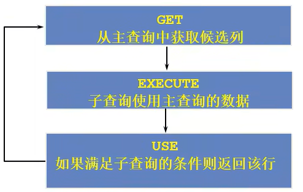
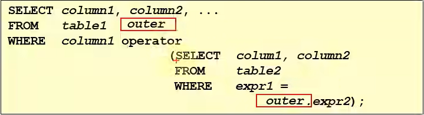

# 相关子查询

---

## 1. 相关子查询执行流程





---

## 2. 练习

### 2.1 查询员工中工资大于本部门平均工资的员工的`last_name`，`salary`和其`department_id`

```sql
每名员工要和自己对应的部门的平均工资对比

方式1：
select last_name,salary,department_id
from employees e1
where salary > (
                select AVG(salary)
                from employees e2
                where department_id=e1.department_id
               );

方式2：
select e1.last_name,e1.salary,e1.department_id
from employees e1,(
                  select department_id,AVG(salary) avg_sal
                  from employees 
                  group by department_id
                  ) dept_avg_sal 
where e1.department_id = dept_avg_sal.department_id 
and e1.salary> dept_avg_sal.avg_sal;
```

### 2.2 查询员工的`salary`，`id`，按照`department_name`排序

```sql
select e.employee_id,e.salary
from employees e
order by (
            select department_name
            from departments d
            where e.department_id=d.department_id 
         ) asc;
```

### 2.3 若`employees`表中`employee_id`与`job_history`表中`employee_id`相同的数目不小于2,输出这些相同`id`的员工的`employee_id`，`last_name`和其`job_id`

```sql
select employee_id,last_name,job_id
from employees e
where 2>= (
            select COUNT(*)
            from job_history j
            where e.department_id=j.department_id
          );
```

---

## 3. `exists` 与 `not exists`

关联子查询和`exists`一起使用，检查子查询中是否存在满足条件的行

```sql
外查询每拿一条记录到内查询去比较，如果返回true就是想要的记录

select employee_id,last_name,job_id,department_id
from employees e1
where exists (
                select *
                from employees
                where e1.employee_id=e2.manager_id
             );
```

### 3.1 查询`departments`表中，不存在于`employees`表中的部门的`department_id`和`department_name`

```sql
方式1：
select d.department_id,d.department_name
from employees e 
right join departments d on e.department_id=d.department_id
where e.department_id is NULL;

方式2：
select department_id,department_name
from departments d
where not exists (
                    select * 
                    from employees e
                    where  d.department_id=e.department_id
                 );

```
