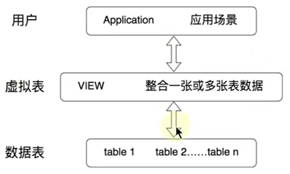

# 视图操作

- [视图操作](#视图操作)
  - [1. 为什么使用视图](#1-为什么使用视图)
  - [2. 视图的理解](#2-视图的理解)
  - [3. 创建视图](#3-创建视图)
    - [3.1 基于单表](#31-基于单表)
    - [3.2 基于多表](#32-基于多表)
  - [4. 查看视图](#4-查看视图)

---

## 1. 为什么使用视图


---

## 2. 视图的理解



**视图本质上就是`select`语句**！

---

## 3. 创建视图

### 3.1 基于单表

```sql
create view 视图名称
as 查询语句

例如：
create view vu_departments
as
select department_id
from departments
where department_id>40;

create view vu_employees
as 
select department_id,AVG(salary)
from employees
group by department_id; 
```

### 3.2 基于多表

```sql
create view vu_more
as*
select e.employee_id,d.department_id
from employees e,departments d
where e.department_id=d.department_id;
```

---

## 4. 查看视图

```sql
show tables;
desc 视图名称;
show table status like 视图名称; -> 查看视图的属性
show create  view 视图名称; -> 查看视图的信息

例如：
show tables;
desc vu_test2;
show table status like vu_test2;
show table view vu_test2;
```

---
