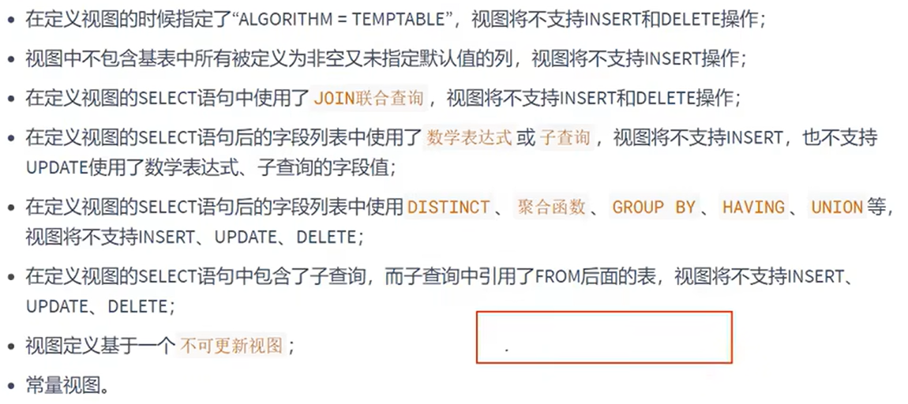

# 更新和修改

- [更新和修改](#更新和修改)
  - [1.数据修改和删除](#1数据修改和删除)
    - [1.1 更新](#11-更新)
    - [1.2 不能更新的情况](#12-不能更新的情况)
    - [2. 删除](#2-删除)
  - [2.视图的修改和删除](#2视图的修改和删除)
    - [2.1 修改](#21-修改)
    - [2.2 删除](#22-删除)

---

## 1.数据修改和删除

### 1.1 更新

修改基表中的数据，同时视图中数据会同步

```sql
update vu_test2
set department_id= 20000
where department_id=10;
```

### 1.2 不能更新的情况

```sql
当涉及修改数据的平均值等
```



### 2. 删除

```sql
delete from vu_test2
where department_id=-1;
```

---

## 2.视图的修改和删除

### 2.1 修改

```sql
方式1：
create or replace view vu_test2
as
select employee_id,last_name,salary,email
from atguigudb.employees
where salary>10000;

方式2：
alter view vu_test2
as
select employee_id,last_name,salary,email
from atguigudb.employees
where salary>10000;
```

### 2.2 删除

```sql
drop view vu_test2;
```

---
