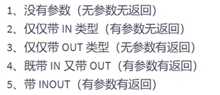
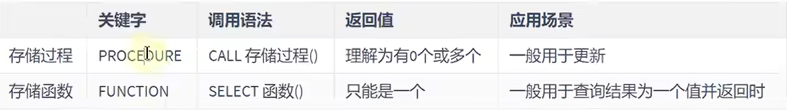

# 存储过程和函数

- [存储过程和函数](#存储过程和函数)
  - [1. 分类](#1-分类)
  - [2. 创建存储过程](#2-创建存储过程)
  - [3. 调用存储过程](#3-调用存储过程)
  - [4. 存储过程练习](#4-存储过程练习)
    - [4.1 类型1 `out`](#41-类型1-out)
    - [4.2 类型2 `in`](#42-类型2-in)
    - [4.3 类型3 `in|out`](#43-类型3-inout)
    - [4.4 类型4 'inout'](#44-类型4-inout)
  - [5. 存储函数(自定义函数)的使用](#5-存储函数自定义函数的使用)
    - [5.1 语法](#51-语法)
    - [5.2 创建时报错](#52-创建时报错)
    - [5.3 练习](#53-练习)
  - [6. 对比存储函数和存储过程](#6-对比存储函数和存储过程)

---

## 1. 分类



---

## 2. 创建存储过程

```sql
create procedure 存储过程名(in | out | inout 参数名 参数类型......)
[characteristics]
begin
存储过程体
end
```

```sql
例如：
delimiter $ --> 将$作为结束符
create procedure select_all_data()
begin
    select * from employees;
end $ --> 结束

delimiter ; --> 将结束符改回;
```

---

## 3. 调用存储过程

```sql
call select_all_data();1
```

---

## 4. 存储过程练习

### 4.1 类型1 `out`

```sql
delimiter $
create procedure show_min_salary(out ms double)
begin 
    select MIN(salary)  into ms -- 将MIN(salary)输出到ms中
    from employees;
end $
delimiter ;

调用： 
call show_min_salary(@ms);
select @ms;
```

### 4.2 类型2 `in`

```sql
delimiter $
create procedure show_someone_salary(in empname varchar(20)) -- 输入值到empname中
begin
    select salary 
    from employees
    where last_name=empname; 
end $
delimiter ;

调用：
方式1：
call show_someone_salary('Tom');
方式2：
set @empname='Tom';
call show_someone_salary(@empname);
```

### 4.3 类型3 `in|out`

```sql
delimiter $

create procedure show_someone_salary(in empname varchar(20),out empsalary decimal(10,2))
begin
    select salary into empsalary
    from employees
    where last_name=empname;
end $

delimiter ;

调用：
set @empname='Abel';
call show_some_salary(@empname,@empsalary);
select @empsalary;
```

### 4.4 类型4 'inout'

```sql
delimiter $

create procedure show_mgr_name(inout empname varchar(25))
begin
    select last_name into empname
    from employees
    where employee_id =(
                        select manager_id
                        from employees
                        where last_name=empname
                       );
end　$

delimiter ;

调用：
set @empname :='Abel';
call show_mgr_name(@empname);
select @empname;
```  

---

## 5. 存储函数(自定义函数)的使用

### 5.1 语法

```sql
create function 函数名(参数名 参数类型...)
return 返回类型
begin
    函数体
end

例如：
delimiter $

create function email_by_name()
returns varchar(15)
    deterministic 
    contains sql
    reads sql data
begin
    return (select email from employees where last_name='Abel');
end $

delimiter ;

调用：
select email_by_name();
```

### 5.2 创建时报错

```sql
方式1：
deterministic 
contains sql
reads sql data

方式2：
创建函数前保证函数创建成功
set global log_bin_trust_function_creators = 1;
```

### 5.3 练习

```sql
类型1： in
delimiter $

create function email_by_id(emp_id int)
returns varchar(15)
    deterministic 
    contains sql
    reads sql data
begin
    return (select email from employees where employee_id=emp_id);
end $

delimiter ;
调用：
set @emp_id=10;
select email_by_id(@emp_id);

类型2：in|out
delimiter $

create function email_by_id(dept_id int)
return int

begin 
    return (select count(*) from employees where department_id = dept_id);
end $

delimiter ;
调用：
set @dept_id  := 10;
select email_by_id(@dept_id);
```

---

## 6. 对比存储函数和存储过程



---
