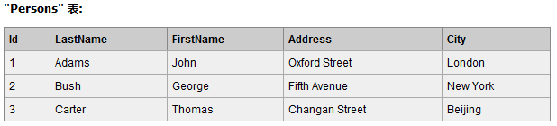
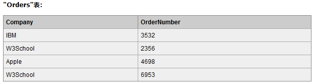

# `SQL SELECT`

---

## 语法

```sql
select 列名称 from 表名称;

例如：
select * from 表名称 选取所有的列;
```  

**实例**：

`select LastName,FirstName from Persons;` 从Persons表中选取LastName,FirstName列的内容  

  

---

## `distinct`  

表中可能有重复值，列出不同的值(distinct)  

```sql
语法：
select distinct 列名称 from 表名称;

例如：
select distinct Company from Orders; 从Orders表中找Company列中的不同的值
```

  

