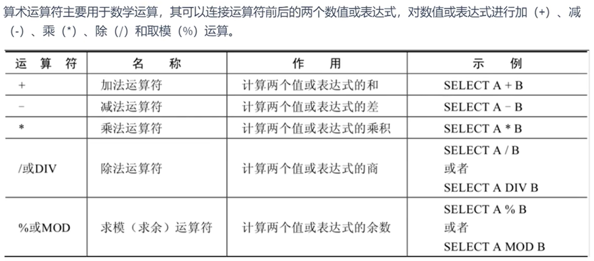
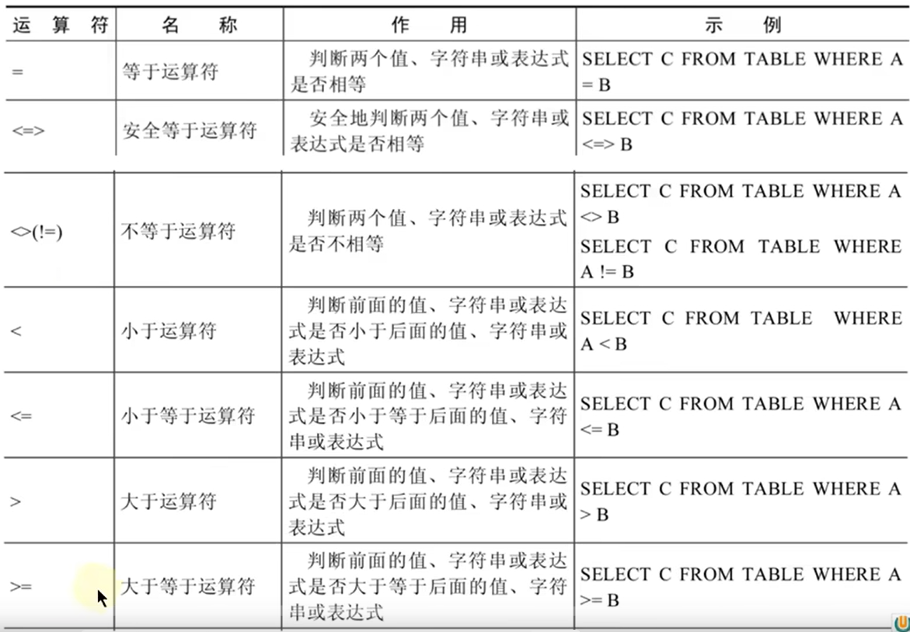
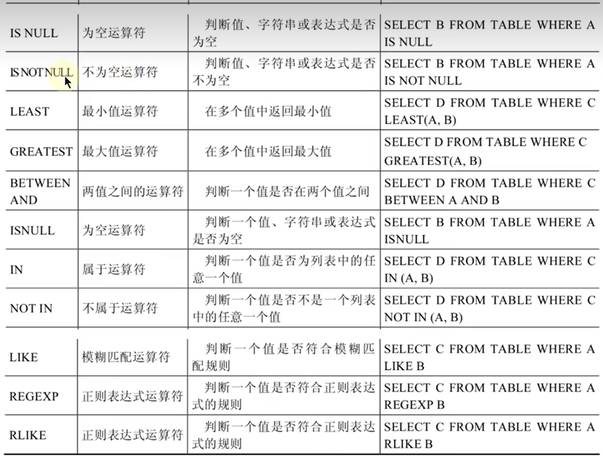
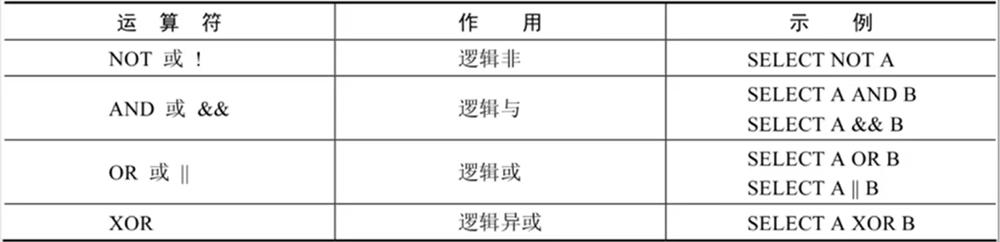
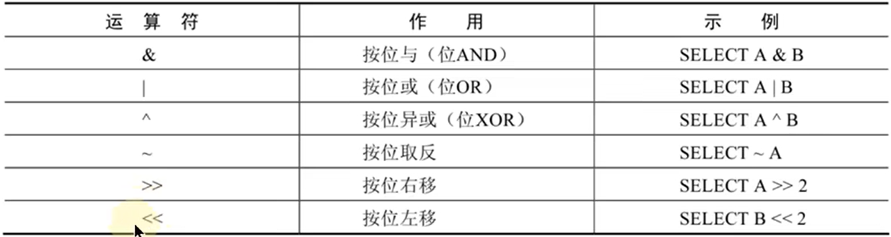

# 运算符  

---

## 算术运算符  

  

```sql
一些特例：
select 100+'a' from DUAL;  ---> 100+'a'=100   'a'=0  1='1'
select 100+null from  DUAL; ---> 100+NULL=NULL
select 100/0 from DUAL;  ---> 100/0=NULL
```

---

## 比较运算符  



```sql
一些特例：
1=NULL,NULL=NULL 只要有NULL，即为NULL  
<=> 安全等于可以对NULL进行判断，NULL<=>NULL=1  NULL<=>1=0  可以查询值为NULL的情况
```  

  

```sql
实例：
between and:
select * from employees where salary between 6000 and 10000; 
                      =  where salary>=6000 and salary <=10000;
select * from employees where salary not between 6000 and 10000;
                      =  where salary<6000 or salary>10000;
in:
select * from employees where department_id=10 or department_id=20 or department_id=30;
                      =  where department_id in (10,20,30); 在(10,20,30)集合中
不在(10,20,30)集合中   = where department_id not in (10,20,30);
like:
select * from employees where last_name like 'a%'; 以a/A开头
select * from employees where last_name like '%a%'; 包含a/A
select * from employees where last_name like '%a'; 以a/A结尾
select * from employees where last_name like '%a%' and last_name like '%e%'; 包含a同时包含e
                      = where last_name like '%a%e' or last_name like'%e%a';
select * from employees where last_name like '_a%'; 第二个字符为a 
select * from employees where last_name like '_\_a'; 第二个字符为_,第三个为a  --> 使用转义
```

---

## 逻辑运算符  

  

```sql
实例：
select * from employees where last_name like '%a' || last_name like 'a%'; 
...
```  

---

## 位运算符  

  
