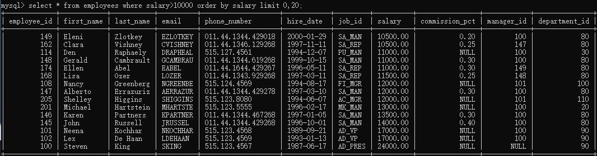

# 排序和分页  

- [排序和分页](#排序和分页)
  - [排序](#排序)
    - [没有排序操作](#没有排序操作)
    - [`order by`](#order-by)
  - [分页](#分页)

---

## 排序  

### 没有排序操作

```sql
没有使用排序操作的话，默认情况上查询返回的数据时按添加的数据的顺序显示的  

```

### `order by`  

```sql
功能：
order by 默认按照顺序排序
逆序排序用 order by .. desc

举例：
asc 升序  --> ascending order
desc 降序 --> Descending
select * from employees order by salary; 按salary升序排序
select * from employees order by salary desc; 按salary降序排列 

二级排序：
select * from employees order by last_name desc,salary asc; 按last_name降序，并按salary升序
```

---

## 分页  

```sql
功能：
limit 分页显示 不可以在SQL Server，DB2，Oracle中使用

举例：
select * from employees limit 起始位置,一页的行数;
select * from employees limit 0,20; 从0开始显示第一页，每页20行
select * from employees limit 20,2; 从20开始显示两个
select * from employees where salary>10000 order by salary limit 0,20;
select * from employees order by salary desc limit 1; 显示salary最高的员工信息

MySQL 8.0特性： select * from employees limit 0 offset 20;
```

  
