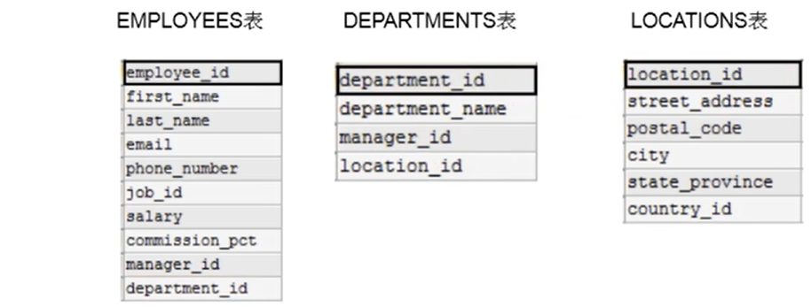
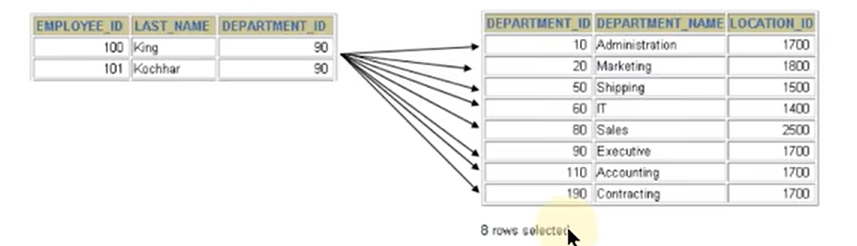
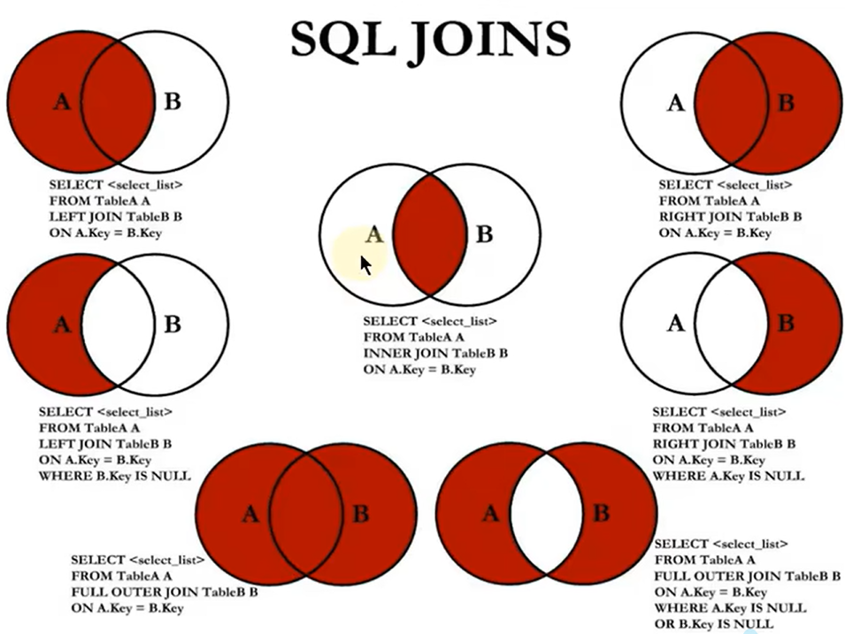
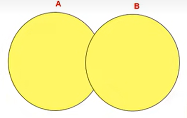
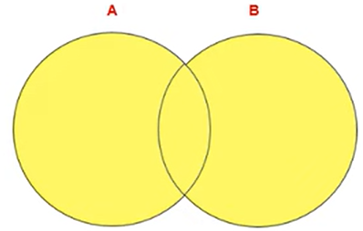

# 多表查询

- [多表查询](#多表查询)
  - [表格实例](#表格实例)
  - [查询](#查询)
  - [多表查询的分类](#多表查询的分类)
    - [等值连接和非等值连接](#等值连接和非等值连接)
    - [自连接和非自连接](#自连接和非自连接)
    - [内连接和外连接](#内连接和外连接)
      - [左外连接](#左外连接)
      - [右外连接](#右外连接)
      - [满外连接](#满外连接)
        - [union操作符](#union操作符)

---

## 表格实例





---

## 查询

**需要有连接条件**： n个表进行多表查询就需要n-1个连接条件

```sql
连接条件:
两个表: 表一与表二的关键字匹配 employees中的department_id -> department中的department_id

例如:
select employee_id,department_name from employees,departments where employees.department_id=department.department_id; 将employees中的department_id与department中的department_id匹配

select employees_id,department_name,employees.department_id from employees,departments where employees.department_id=departments.department_id;  如果多个表中出现相同的字段,必须指定该字段所在的表

要指定每个表中的哪个字段:
select employees.employees_id,departments.department_name,employees.department_id from employees,departments where employees.department_id=departments.department_id; 

当很长的时候可以起别名
```

---

## 多表查询的分类

### 等值连接和非等值连接

```sql
非等值连接:
不是相等关系,在一个范围里面
select e.last_name,e.salary,j.grade_level  from employees e,job_grades j where e.salary between j.lowest_sal and j.highest_sal; 

等值连接:
相等关系
select employee_id,department_name from employees,departments where employees.department_id=department.department_id; 将employees中的department_id与department中的department_id匹配
```

### 自连接和非自连接

```sql
查询员工id,员工姓名以及管理者的id和姓名 -> 员工可能也是管理者 即自连接

例如:
即员工表和管理者表是同一张表,员工表的manger_id=管理者表的employee_id
select emp.employee_id,emp.last_name,mgr.employee_id,mgr.last_name from employees emp,employees mgr where emp.manager_id=mgr.employee_id;
```

---

### 内连接和外连接  



```sql
内连接:
合并具有同一列的两个以上的表的行,结果集中不包含一个表与另一个表不匹配的行  -> 只查匹配的行
select e.employee_id,d.department_name from employees e,departments d where e.department_id=d.department_id;
只是将左表和右表满足条件e.department_id=d.department_id的找出来了

外连接:  -> 除了匹配的行,还有不匹配的行
合并具有同一列的两个以上的表的行,结果集中包含一个表与另一个表匹配的行之外,还查询到了左表 或 右表中不匹配的行
外连接: 左外连接,右外连接,满外连接
```  

#### 左外连接

```sql
合并具有同一列的两个以上的表的行,结果集中包含一个表与另一个表匹配的行之外,还查询到了左表中不匹配的行
例如:
查所有员工的信息
SQL92语法:  -> MYSQL不支持SQL92语法
select employee_id,department_name from employees,departments where employees.department_id=department.department_id(+);

SQL99语法:
实现内连接: select employee_id,department_name from employees join departments on employees.department_id=departments.department_id; 

实现左外连接: select employee_id,department_name from employees left join departments on employees.department_id=departments.department_id;
```

#### 右外连接

```sql
SQL92语法:
select employee_id,department_name from employees,departments where employees.department_id(+)=department.department_id;

SQL99语法:
select e.employee_id,d.department_name from employees e right join departments d on e.department_id=d.department_id;
```

---

#### 满外连接

```sql
full outer join -> mysql不支持
select e.employee_id,d.department_name from employees e full outer join departments d on e.department_id=d.department_id;
```

##### union操作符

`union`操作符： 返回两个查询的结果集的并集，去重



`union all`操作符：返回两个查询的结果集的并集，不去重，查询效率比`union`高



**即适用于mysql的满外连接查询为**：

```sql
union 实现满外连接：
select e.employee_id,d.department_name from employees e left join departments d on e.department_id=d.department_id union  select e.employee_id,d.department_name from employees e right join departments d on e.department_id=d.department_id;

union all 实现满外连接：
select e.employee_id,d.department_name from employees e left join departments d on e.department_id=d.department_id union all select e.employee_id,d.department_name from employees e right join departments d on e.department_id=d.department_id where e.department_id is NULL;
select e.employee_id,d.department_name from employees e left join departments d on e.department_id=d.department_id where d.department_id is NULL union all select e.employee_id,d.department_name from employees e right join departments d on e.department_id=d.department_id;
```
