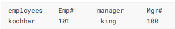

# 例题

- [例题](#例题)
  - [1.显示所有员工的姓名，部门号和部门名称](#1显示所有员工的姓名部门号和部门名称)
  - [2.查询90号部门员工的job\_id和90号部门的location\_id](#2查询90号部门员工的job_id和90号部门的location_id)
  - [3.选择所有有奖金的员工的 last\_name , department\_name , location\_id , city](#3选择所有有奖金的员工的-last_name--department_name--location_id--city)
  - [4.选择city在Toronto工作的员工的 last\_name , job\_id , department\_id , department\_name](#4选择city在toronto工作的员工的-last_name--job_id--department_id--department_name)
  - [5.查询员工所在的部门名称、部门地址、姓名、工作、工资，其中员工所在部门的部门名称为’Executive’](#5查询员工所在的部门名称部门地址姓名工作工资其中员工所在部门的部门名称为executive)
  - [6. 选择指定员工的姓名，员工号，以及他的管理者的姓名和员工号，结果类似于下面的格式](#6-选择指定员工的姓名员工号以及他的管理者的姓名和员工号结果类似于下面的格式)
  - [7.查询哪些部门没有员工](#7查询哪些部门没有员工)
  - [8.查询哪个城市没有部门](#8查询哪个城市没有部门)
  - [9.查询部门名为 Sales 或 IT 的员工信息](#9查询部门名为-sales-或-it-的员工信息)

---


---

## 1.显示所有员工的姓名，部门号和部门名称

包含**所有**两字，即要想到外连接，包含所有的员工，使用左外连接所有的员工都要包含

```sql
select e.employee_name,d.department_id,d.department_name 
from employees e 
left join departments d on e.department_id=d.department_id;
```

---

## 2.查询90号部门员工的job_id和90号部门的location_id

查询`employees`

```sql
select e.job_id,d.location_id 
from employees e 
join departments d on e.department_id=d.department_id 
where e.department_id=90; 

或者：
select e.job_id,d.location_id 
from employees e,departments d 
where e.department_id=d.department_id and e.department_id=90;
```

---

## 3.选择所有有奖金的员工的 last_name , department_name , location_id , city

包含**所有**两字就该想到**外连接**，在`employees`中取`last_name`,在`departments`中取`department_id,location_id`,在`location`表中取`city`
即：
所有包含有奖金的员工，即左外连接
`departments`表对`locations`表为左外连接

```sql
select e.last_name,d.department_name,d.location_id,l.city
from employees e 
left join departments d on e.department_id=d.department_id
left join locations l on d.location_id=l.location_id 
where e.commission_pct is not NULL;
```

---

## 4.选择city在Toronto工作的员工的 last_name , job_id , department_id , department_name

```sql
select e.last_name,e.job_id,d.department_id,d.department_name 
from employees e,departments d,locations l
where e.department_id=d.department_id && d.location_id=l.location_id and l.city='Toronto';

或者:
select e.last_name,e.job_id,d.department_id,d.department_name
from employees e 
join departments d on e.department_id=d.department_id
join locations l on d.location_id=l.location_id
where l.city='Toronto';
```

---

## 5.查询员工所在的部门名称、部门地址、姓名、工作、工资，其中员工所在部门的部门名称为’Executive’

```sql
select d.department_name,l.street_address,e.last_name,e.job_id,e.salary 
from employees e,departments d,locations l
where e.department_id=d.department_id 
and d.location_id=l.location_id
and d.department_name='Executive';

或者：
select d.department_name,l.street_address,e.last_name,e.job_id,e.salary
from employees e
join departments d on e.department_id=d.department_id
join locations l   on d.location_id=l.location_id
where d.department_name='Executive'; 
```

---

## 6. 选择指定员工的姓名，员工号，以及他的管理者的姓名和员工号，结果类似于下面的格式



在字段添加空格后添加指定别名
员工可能为管理者，即为自引用
员工可能没有管理者，即为左外连接

```sql
select e.last_name employees,e.employee_id "Emp#",mgr.last_name manager,mgr.employee_id "Mgr#"
from employees e
left join employees mgr on e.manager_id=mgr.employee_id;
```

---

## 7.查询哪些部门没有员工

部门 `->` 员工  匹配`department_id`  

```sql
select d.department_id 
from departments d
left join employees e on e.department_id=d.department_id
where e.employee_id is NULL;
```

---

## 8.查询哪个城市没有部门

```sql
select l.location_id
from locations l
left join departments d on d.location_id=l.location_id
where d.department_id is NULL; 
```

## 9.查询部门名为 Sales 或 IT 的员工信息

```sql
select e.employee_id,e.last_name,d.department_name
from employees e,departments d
where e.department_id=d.department_id
and d.department_name in ('Sales','IT');
```
