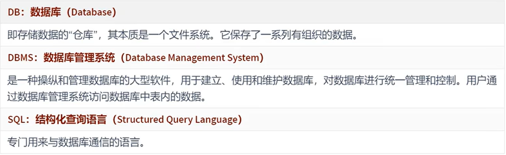
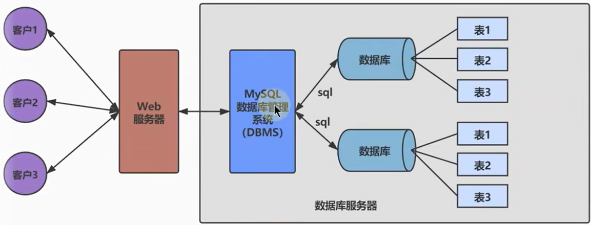
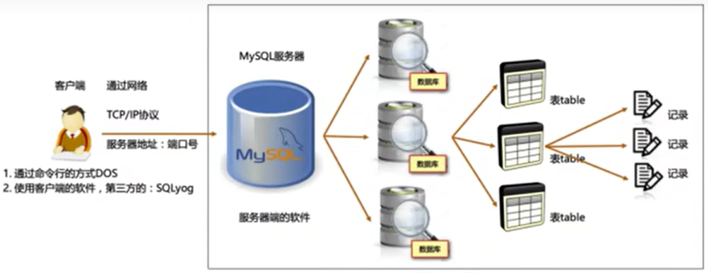
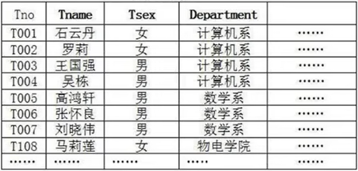
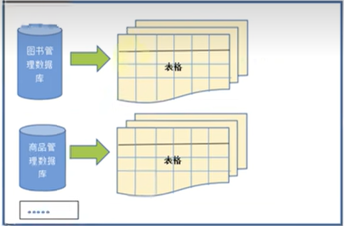
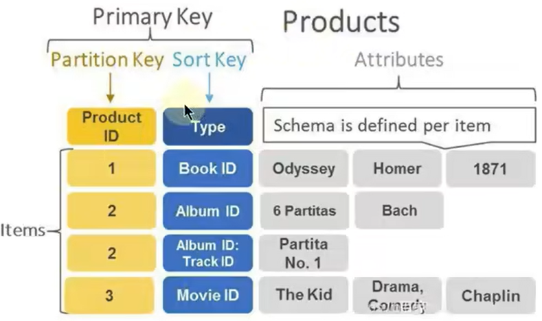
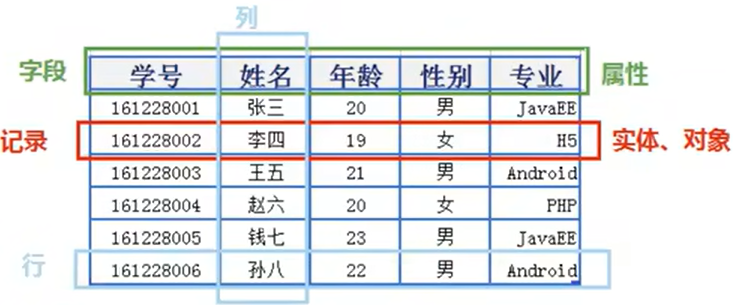

# 数据库概述

## 数据库和数据库管理系统  

---

### 数据库的概念  

  

---

### 数据库和数据库管理系统的关系  

  

  

---

## RDBMS与非RDBMS  

### 关系型数据库(RDBMS)  

  

关系型数据库以列和行的形式存储数据，行+列 ->  表(table)  
关系型数据库建立在**关系模型**基础上的数据库  

  

* 复杂查询
  可以用sql语句进行单表或多表中之间做复杂的数据查询  

* 事务支持

### 非关系型数据库(非RDBMS)  

基于键值对存储数据，不通过SQL层的解析，性能高  

#### 键值型数据库  

Key-Value键值方式存储数据，查找速度快，但是无法进行条件过滤  

  

#### 文档型数据库  

特别的Key-Value，存放的值为文档  

#### 搜索引擎数据库  

爬取数据-->特定的格式

#### 图形数据库  

图形关系的进行存储，结点和边  

---

### 关系型数据库设计规则  

* 关系型数据库的典型数据结构为**数据表**  
* 数据存放到表中，表存在库中
* 一个库有多个表，表名有唯一性

#### 表，记录，字段  

```c++
表 --> 类 
记录 --> 对象 
列 --> 字段，属性 
```

  

#### 表的关联关系  

##### 一对一  
