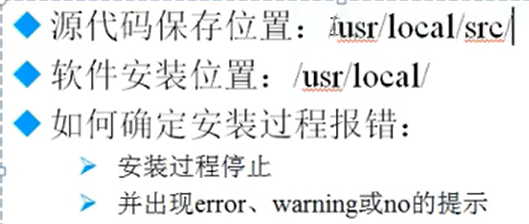
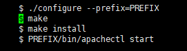
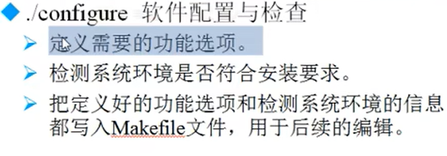

# 源码包安装

---

## 安装注意事项



## 安装过程

```Linux
1. 下载源码包 --> 用winSCP将windows上的包移动到Linux上
2. 解压缩下载的源码包
3. 进入解压缩目录
```  

进入到目录中查看`INSTALL`文件中的内容



进入目录进行软件配置和检查



编译：`make`  
如果想删除包，用 `make clean`清空

编译安装：`make install`

---

## 源码包卸载

```Linux
不需要使用卸载命令，直接删除安装目录即可
例如：
rm -rf /usr/local/apache2 
```

---
