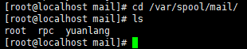

# 用户管理相关文件

- [用户管理相关文件](#用户管理相关文件)
  - [用户的家目录](#用户的家目录)
  - [用户的邮箱](#用户的邮箱)
  - [用户模板目录](#用户模板目录)

---

## 用户的家目录

```Linux
普通用户：/home/用户名/，所有者和所属组都是该用户，权限为700
超级用户：/root/，所有者和所属组都是root用户，权限为550
```

---

## 用户的邮箱

```Linux
/var/spool/mail/用户名/
```



---

## 用户模板目录

```Linux
/etc/skel/
```
