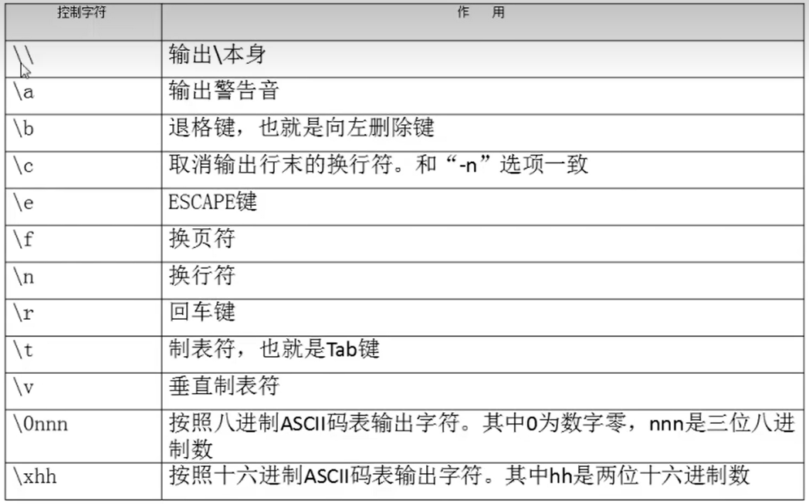

# `Shell`脚本的执行方式

- [`Shell`脚本的执行方式](#shell脚本的执行方式)
  - [1. `echo`输出命令](#1-echo输出命令)
  - [2.脚本](#2脚本)
  - [3. 运行脚本](#3-运行脚本)
  - [4. 转换](#4-转换)

---

## 1. `echo`输出命令

```Linux
echo [选项] [输出内容]
     -e 支持反斜杠控制的字符转换
```



---

## 2.脚本

```Linux
vim hello.sh 创建.sh脚本文件
进入vim后写
```

---

## 3. 运行脚本

```Linux
方式1：-> 惯用
赋予权限，直接运行 
chmod 755 hello.sh
./hello.sh

方式2：
bash hello.sh
```

---

## 4. 转换

```Linux
dos2unix test.sh 将window格式转换为unix格式
```
