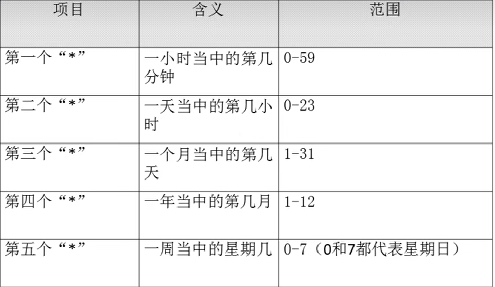
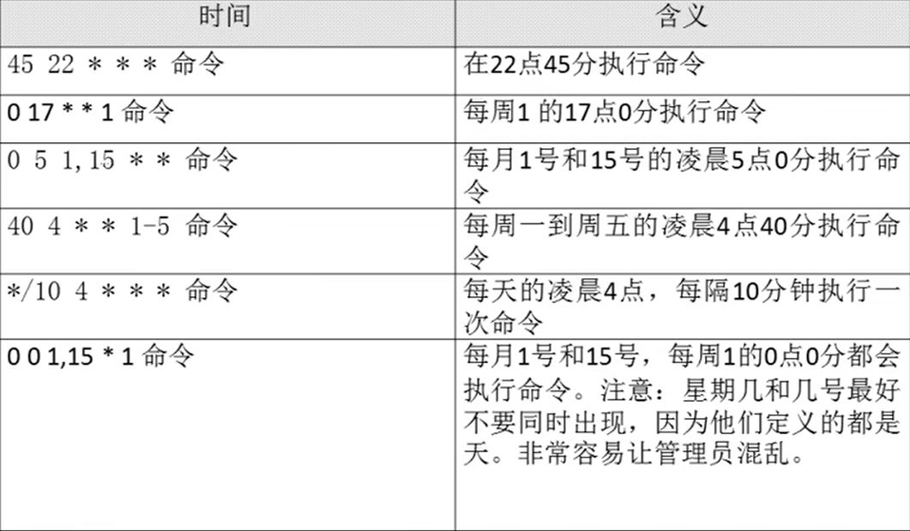

# 系统定时任务

- [系统定时任务](#系统定时任务)
  - [1. `crond`服务管理与访问控制](#1-crond服务管理与访问控制)
  - [2. 用户的`crontab`设置](#2-用户的crontab设置)

---

## 1. `crond`服务管理与访问控制

```Linux
service crond restart

chkconfig crond on
```

---

## 2. 用户的`crontab`设置

```Linux
crontab [选项]
```


```Linux
crontab e 进入vim中编辑

vim中格式为: * * * * * command

例如：
10 12 * * * command 每天的12点10分执行
10 12 * * 1 command 每周一的12点10分执行
```

**格式为**：





```Linux
* -> 任一时间
, -> 不连续时间 如 "0 8,12,16 * * *" 每天的8:0,12:0,16:0分执行
- -> 时间范围  如 "0  8 * * 1-6" 每周1到周六8:0执行
*/n -> 间隔多久执行一次 如"*/10 * * * *" 间隔10分钟执行一次 
```

```Linux
* * * * * test.sh 定时执行脚本
```

---
