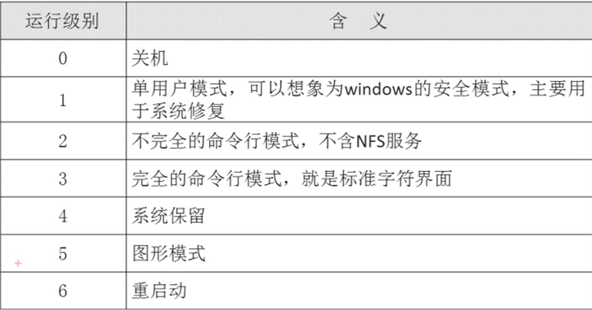
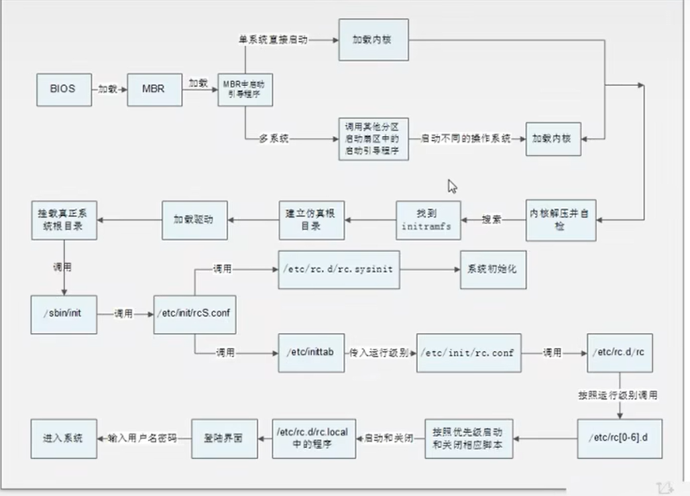

# 启动流程

- [启动流程](#启动流程)
  - [1. 启动级别](#1-启动级别)
  - [2. 启动级别命令](#2-启动级别命令)
  - [3. 启动过程](#3-启动过程)

---

## 1. 启动级别



---

## 2. 启动级别命令

```Linux
runlevel 查看运行级别

init 运行级别  -> 改变运行级别
```

---

## 3. 启动过程



---
