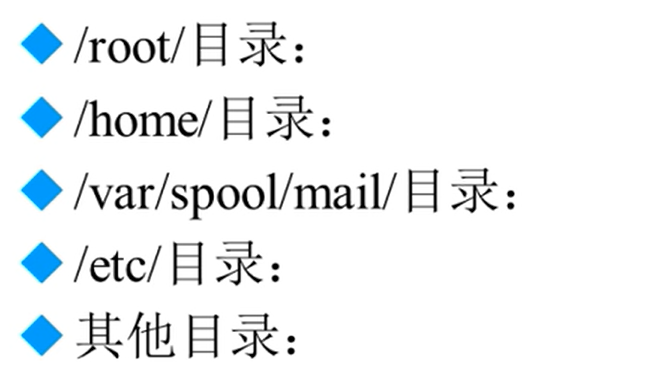
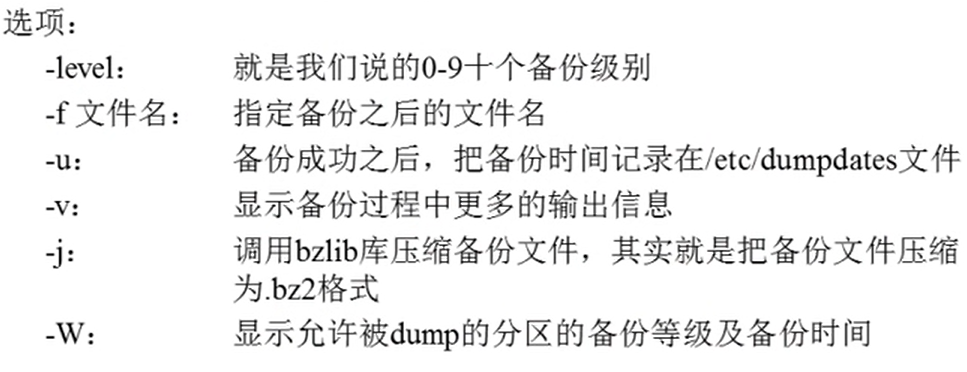
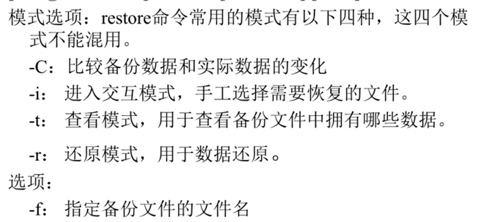

# 备份与恢复

- [备份与恢复](#备份与恢复)
  - [1. Linux需要备份的数据](#1-linux需要备份的数据)
  - [2. 备份命令](#2-备份命令)
  - [3. 恢复命令](#3-恢复命令)

---

## 1. Linux需要备份的数据



---

## 2. 备份命令

```Linux
dump [选项] 备份后的文件名 原文件或目录
```



```Linux
例如：
dump -0uj -f /tmp/root.bz2 /root/  备份分区
dump -0j 0f /root/test.bz2 /root/test 备份文件或目录
```

## 3. 恢复命令

```Linux
restore [模式选项] [选项]
```



```Linux
例如：
restore -r -f /root/test2 恢复test2
```
